# Fluffy UI Pre-Migration Audit

> **Document Classification:** Strict Pre-Migration Architecture, API, & Capability Audit  
> **Target Application:** Fluffy Assistant / Fluffy Desktop  
> **Source of Truth:** Current Codebase Implementation  
> **Audit Status:** Complete & Verified  

---

## 1. Audit Scope

This document provides a comprehensive, read-only architectural audit of the **Fluffy Assistant / Fluffy Desktop** application to serve as the definitive integration blueprint for the upcoming frontend migration to **React + TypeScript Workbench**.

### Core Tenets of the Audit
1. **Repository as Source of Truth:** Every entry reflects active code in Rust Core, Python Brain, Tauri IPC, Services, and Frontend. Discrepancies between documentation and code are explicitly noted.
2. **Zero Code Modification:** No existing backend interfaces, data structures, ports, protocols, or logic have been altered during this audit.
3. **Comprehensive Traceability:** Every interface maps directly to source file paths, line numbers, request/response contracts, and calling UI components.
4. **Preservation Guarantee:** Highlights all backend capabilities (both UI-exposed and orphaned) to ensure zero feature regression during frontend re-architecture.

---

## 2. Current Repository Structure

```text
FluffyAssistent/
├── .agents/                      # Workflow specifications and agent guidelines
├── .env / .env.example           # Environment configuration (FLUFFY_TOKEN, ports, paths)
├── assets/                       # Branding assets, icons, default SVG logos
├── brain/                        # Python Brain Engine (FastAPI/Flask Web API, AI, Guardian)
│   ├── agent/                    # Autonomous agent orchestration, execution, plan, steps
│   ├── ai/                       # AI models, prompt templates, providers
│   ├── artifacts/                # Generated code & artifacts runtime storage
│   ├── assets/                   # Extension icons, logos, static assets
│   ├── context/                  # Context management, system state injection
│   ├── guardian/                 # Guardian security system (anomaly, baseline, chains, verdict)
│   ├── knowledge/                # Vector store, embeddings (local/openai), retrieval, ingestion
│   ├── mcp/                      # Model Context Protocol (client, registry, transport, manager)
│   ├── memory/                   # Session memory, long-term memory, user profile, preferences
│   ├── multimodal/               # Multi-modal input handling
│   ├── routes/                   # Flask Blueprints (cluster, extension, ftp, network, terminal, voice)
│   ├── runtime/                  # Runtime state, alerts, Rust capability client bridge
│   ├── sandbox/                  # Safe Python code execution sandbox
│   ├── security/                 # Policy validation, security monitors
│   ├── tools/                    # Tool definitions, adapters, registries, execution engine
│   ├── listener.py               # Background IPC listener (TCP 9001 -> Core), signal computation
│   └── web_api.py                # Main Flask HTTP/SSE API Server (Port 5123)
├── core/                         # Rust Native Core Engine
│   ├── Cargo.toml                # Core dependencies (sysinfo, windows-sys, tokio, etc.)
│   └── src/
│       ├── actions/              # Native OS execution actions (process kill, cleanup)
│       ├── capabilities/         # First-class native capability system (dispatch, registry, handlers)
│       │   └── handlers/         # Process, Filesystem, Application, System, Network handlers
│       ├── etw.rs                # Windows ETW real-time per-PID network bandwidth monitor
│       ├── ipc/                  # IPC Server (TCP 9001) & Command Receiver (TCP 9002)
│       ├── permissions/          # Protected processes and path traversal guards
│       ├── terminal/             # Core Admin Terminal TCP server (9000) & WS Bridge (9003)
│       └── main.rs               # Core daemon entry point & telemetry broadcast loop
├── fluffy/                       # Fluffy distributed networking package
│   └── network/                  # Peer-to-peer LAN monitoring (role_manager, server, client, auth)
├── services/                     # Background auxiliary services
│   ├── ftp_service.py            # pyftpdlib FTP server (Port 2121) with QR and speed tracking
│   └── utils/                    # QR generator utilities
├── ui/                           # Desktop User Interface
│   └── tauri/                    # Tauri v2 Desktop Wrapper
│       ├── index.html            # Main Single-Page Interface (11 view sections)
│       ├── package.json          # Vite + TypeScript + Lucide build config
│       ├── src/
│       │   ├── main.ts           # Frontend controller (4,317 lines, all API integrations)
│       │   ├── types/            # TypeScript domain interfaces (contracts.ts)
│       │   └── styles.css        # Core styling, responsive layouts, theme variables
│       └── src-tauri/
│           ├── Cargo.toml        # Tauri Rust configuration
│           └── src/lib.rs        # Tauri setup, child process management, tray menu, lifecycle
└── voice/                        # TTS/STT speech engine (pyttsx3 / Vosk integration)
```

---

## 3. Architecture Actually Implemented

```mermaid
flowchart TD
    subgraph UI_Layer ["Frontend UI Layer (Tauri v2)"]
        HTML["index.html (11 View Sections)"]
        MainTS["src/main.ts (Controller & Polling)"]
        HTML --- MainTS
    end

    subgraph Tauri_Rust ["Tauri Host Bridge (Rust)"]
        LibRs["src-tauri/src/lib.rs"]
        Tray["System Tray & Window Lifecycle"]
        Spawn["Process Supervisor (Spawns Brain)"]
    end

    subgraph Rust_Core ["Rust Core Engine (Native OS Daemon)"]
        CoreMain["core/src/main.rs"]
        ETW["ETW Network Monitor (Admin)"]
        SysInfo["SysInfo Telemetry Loop"]
        CapReg["Capability Registry & Dispatch"]
        TcpTelemetry["TCP 9001: Telemetry Server"]
        TcpCommands["TCP 9002: Command Receiver"]
        WsBridge["WS 9003: Terminal WS Bridge"]
        TcpAgents["TCP 9000: Terminal Agent Server"]
    end

    subgraph Python_Brain ["Python Brain (AI & Security Engine)"]
        Listener["brain/listener.py (IPC Client)"]
        WebApi["brain/web_api.py (Flask Port 5123)"]
        Guardian["Guardian Behavioral Security"]
        Memory["Session & Long Term Memory"]
        AgentEngine["Agent Orchestrator & Tools"]
        Knowledge["Knowledge & RAG Engine"]
    end

    subgraph Aux_Services ["Auxiliary Services & LAN"]
        FtpServer["FTP Service (Port 2121)"]
        LanServer["LAN Availability Server (Port 9000)"]
    end

    MainTS -->|"HTTP REST & SSE (Port 5123)"| WebApi
    MainTS -->|"WebSocket (Port 9003)"| WsBridge
    MainTS -->|"Tauri IPC invoke('graceful_shutdown')"| LibRs

    LibRs -->|"HTTP POST /ui_connected (5123)"| WebApi
    LibRs -->|"TCP SetUiActive (9002)"| TcpCommands

    Listener -->|"TCP 9001 Telemetry Stream"| TcpTelemetry
    WebApi -->|"TCP 9002 Commands"| TcpCommands
    WebApi -->|"Internal async WS"| WsBridge

    WebApi --- Guardian
    WebApi --- Memory
    WebApi --- AgentEngine
    WebApi --- Knowledge
    WebApi -->|"Internal Python call"| FtpServer
    WebApi -->|"Internal Python call"| LanServer
    CoreMain --- ETW
    CoreMain --- SysInfo
    CoreMain --- CapReg
```



### Communication Channels & Port Allocation
| Channel | Port / Protocol | Source | Target | Purpose |
| :--- | :--- | :--- | :--- | :--- |
| **HTTP Web API** | `http://127.0.0.1:5123` | Frontend (`main.ts`) / Tauri (`lib.rs`) | Python Brain (`web_api.py`) | Primary command execution, chat, status, apps, voice, guardian |
| **Terminal WS Bridge** | `ws://127.0.0.1:9003` | Frontend (`main.ts`) / Brain (`terminal_routes.py`) | Rust Core (`ws_bridge.rs`) | Terminal stream, console output, agent control |
| **Telemetry IPC** | `tcp://127.0.0.1:9001` | Python Brain (`listener.py`) | Rust Core (`ipc/server.rs`) | High-frequency telemetry broadcast (CPU, RAM, ETW network, startup apps) |
| **Command IPC** | `tcp://127.0.0.1:9002` | Python Brain (`commands.py`) / Tauri (`lib.rs`) | Rust Core (`ipc/receiver.rs`) | Native execution (kill process, startup toggle, normalize, capabilities) |
| **Terminal Agents** | `tcp://0.0.0.0:9000` | Remote `fluffy-client.exe` | Rust Core (`terminal/net.rs`) | Remote agent management terminal session |
| **LAN Availability** | `http://0.0.0.0:9000` | Remote Fluffy Admins | Fluffy Network (`server.py`) | Peer-to-peer telemetry scraping and remote process actions |
| **FTP File Sharing** | `ftp://0.0.0.0:2121` | LAN FTP Clients / Browsers | Python Services (`ftp_service.py`) | Local LAN secure file transfer with live bandwidth tracking |

---

## 4. HTTP API Inventory

Total HTTP API Endpoints Discovered: **97 Endpoints** across 7 routing modules.

### A. Core Web API (`brain/web_api.py`)

#### API-001
- **Method:** `GET`
- **Endpoint:** `/.well-known/appspecific/<path:_>`
- **Backend File:** `brain/web_api.py:41`
- **Handler:** `chrome_probe`
- **Purpose:** Suppresses 404 logs from Chromium browser probes during development.
- **Request:** None
- **Response:** HTTP 204 No Content
- **Authentication:** None
- **Frontend Caller:** Browser DevTools / Webview internal
- **UI Feature:** Internal diagnostic
- **Type:** One-shot | **Migration Importance:** LOW

#### API-002
- **Method:** `GET`
- **Endpoint:** `/`
- **Backend File:** `brain/web_api.py:46`
- **Handler:** `root`
- **Purpose:** Basic health and service discovery verification.
- **Request:** None
- **Response:** `{"service": "Fluffy Brain API", "status": "active", "dashboard": "Tauri (Native) Only"}`
- **Authentication:** None
- **Frontend Caller:** Diagnostics / smoke test
- **UI Feature:** Server health
- **Type:** One-shot | **Migration Importance:** LOW

#### API-003
- **Method:** `GET`
- **Endpoint:** `/status`
- **Backend File:** `brain/web_api.py:51`
- **Handler:** `status`
- **Purpose:** Authoritative full system state snapshot (CPU, RAM, Disks, Networks, Processes, Battery, Bluetooth, Guardian alerts, Pending confirmations, Notifications, TTS mute state, Active sessions).
- **Request:** None
- **Headers:** `X-Fluffy-Token: <token>`
- **Response:** `SystemStatus` JSON object
- **Frontend Caller:** `ui/tauri/src/main.ts:1710` (`fetchData()`)
- **UI Feature:** Dashboard, Header Status, Processes, Guardian, Analytics, Status Bar
- **Polling Frequency:** Dynamic adaptive: 2,000ms (Active) / 10,000ms (Idle)
- **Type:** Polling | **Migration Importance:** CRITICAL

#### API-004
- **Method:** `GET`
- **Endpoint:** `/logs`
- **Backend File:** `brain/web_api.py:91`
- **Handler:** `logs`
- **Purpose:** Returns rolling execution log buffer.
- **Headers:** `X-Fluffy-Token: <token>`
- **Response:** Array of `[{"timestamp": "...", "message": "...", "type": "info"|"action"|"error"|"system"}]`
- **Frontend Caller:** `ui/tauri/src/main.ts:1757` (`fetchLogs()`)
- **UI Feature:** Dashboard Live Logs Console
- **Polling Frequency:** Every 5,000ms
- **Type:** Polling | **Migration Importance:** HIGH

#### API-005
- **Method:** `GET`
- **Endpoint:** `/config/token`
- **Backend File:** `brain/web_api.py:101`
- **Handler:** `get_token`
- **Purpose:** Loopback auth token discovery for UI client initialization.
- **Request:** Restricted to `127.0.0.1` / `::1`
- **Response:** `{"token": "fluffy_dev_token"}`
- **Frontend Caller:** `ui/tauri/src/main.ts:11` (`initToken()`)
- **UI Feature:** App Startup / Auth Handshake
- **Type:** One-shot (on boot) | **Migration Importance:** CRITICAL

#### API-006
- **Method:** `POST`
- **Endpoint:** `/command`
- **Backend File:** `brain/web_api.py:112`
- **Handler:** `command`
- **Purpose:** Forwards structured commands directly to Rust Core TCP command receiver (9002).
- **Request Body:** JSON payload e.g. `{"KillProcess": {"pid": 1234}}` or `{"Confirm": {"command_id": "..."}}`
- **Headers:** `X-Fluffy-Token: <token>`
- **Response:** `{"ok": true}`
- **Frontend Caller:** `ui/tauri/src/main.ts:693` (`confirmCommand`), `main.ts:718` (`killProcess`), `main.ts:1433` (`toggleStartupApp`)
- **UI Feature:** Process Termination, Confirmation Actions, Startup App Management
- **Type:** One-shot | **Migration Importance:** CRITICAL

#### API-007
- **Method:** `POST`
- **Endpoint:** `/security_action`
- **Backend File:** `brain/web_api.py:130`
- **Handler:** `security_action`
- **Purpose:** Executes Guardian security action on suspicious processes (`kill`, `isolate`, `trust`).
- **Request Body:** `{"pid": 1234, "action": "kill"|"trust"}`
- **Headers:** `X-Fluffy-Token: <token>`
- **Response:** `{"ok": true}`
- **Frontend Caller:** `ui/tauri/src/main.ts:1314`
- **UI Feature:** Guardian Alert Resolution
- **Type:** One-shot | **Migration Importance:** HIGH

#### API-008
- **Method:** `POST`
- **Endpoint:** `/trust_process`
- **Backend File:** `brain/web_api.py:174`
- **Handler:** `trust_process`
- **Purpose:** Permanently whitelists a process name in Guardian memory.
- **Request Body:** `{"name": "code.exe", "risk_score": 15}`
- **Headers:** `X-Fluffy-Token: <token>`
- **Response:** `{"ok": true, "message": "..."}`
- **Frontend Caller:** `ui/tauri/src/main.ts:1314` (`trustProcess()`)
- **UI Feature:** Guardian Threat Management
- **Type:** One-shot | **Migration Importance:** HIGH

#### API-009
- **Method:** `POST`
- **Endpoint:** `/clear_guardian`
- **Backend File:** `brain/web_api.py:227`
- **Handler:** `clear_guardian`
- **Purpose:** Resets Guardian behavioral baselines, anomaly states, and alert buffers.
- **Headers:** `X-Fluffy-Token: <token>`
- **Response:** `{"ok": true, "message": "Guardian memory cleared"}`
- **Frontend Caller:** `ui/tauri/src/main.ts:1335` (`clearGuardianData()`)
- **UI Feature:** Guardian Baseline Reset
- **Type:** One-shot | **Migration Importance:** MEDIUM

#### API-010
- **Method:** `POST`
- **Endpoint:** `/normalize`
- **Backend File:** `brain/web_api.py:239`
- **Handler:** `normalize`
- **Purpose:** Triggers deep OS system cleanup, cache flushing, and working set reduction via Core.
- **Headers:** `X-Fluffy-Token: <token>`
- **Response:** `{"ok": true, "ram_freed_mb": 450, "actions_taken": [...]}`
- **Frontend Caller:** `ui/tauri/src/main.ts:557` (`normalizeSystem()`)
- **UI Feature:** Dashboard Normalize System Button
- **Type:** One-shot | **Migration Importance:** HIGH

#### API-011 & API-012
- **Method:** `GET`, `POST`
- **Endpoints:** `/ui_connected`, `/ui_disconnected`
- **Backend File:** `brain/web_api.py:267, 275`
- **Handler:** `ui_connected`, `ui_disconnected`
- **Purpose:** Sets Brain telemetry throttling state based on frontend visibility.
- **Headers:** `X-Fluffy-Token: <token>`
- **Response:** `{"ok": true}`
- **Frontend / Tauri Caller:** `ui/tauri/src-tauri/src/lib.rs:42-56` (`notify_python_ui_state`)
- **UI Feature:** App lifecycle & power conservation
- **Type:** Event-driven | **Migration Importance:** HIGH

#### API-013
- **Method:** `POST`
- **Endpoint:** `/net-speed`
- **Backend File:** `brain/web_api.py:292`
- **Handler:** `net_speed`
- **Purpose:** Runs real-time ping and bandwidth speed test.
- **Headers:** `X-Fluffy-Token: <token>`
- **Response:** `{"ok": true, "ping_ms": 14, "download_mbps": 120.5, "upload_mbps": 45.2}`
- **Frontend Caller:** `ui/tauri/src/main.ts:1186` (`runSpeedTest()`)
- **UI Feature:** Dashboard Speed Test Button
- **Type:** One-shot | **Migration Importance:** MEDIUM

#### API-014
- **Method:** `GET`
- **Endpoint:** `/apps`
- **Backend File:** `brain/web_api.py:317`
- **Handler:** `get_apps`
- **Purpose:** Returns list of system-installed desktop applications from cache.
- **Headers:** `X-Fluffy-Token: <token>`
- **Response:** `[{"id": "...", "name": "...", "publisher": "...", "version": "...", "exe_path": "...", "icon_data": "data:image/png;base64,...", "size_kb": 123400}]`
- **Frontend Caller:** `ui/tauri/src/main.ts:2073` (`fetchApps()`)
- **UI Feature:** Applications Grid View
- **Type:** One-shot / On view activate | **Migration Importance:** HIGH

#### API-015
- **Method:** `POST`
- **Endpoint:** `/apps/refresh`
- **Backend File:** `brain/web_api.py:327`
- **Handler:** `refresh_apps`
- **Purpose:** Forces a deep re-scan of Windows Registry and start menu shortcuts.
- **Headers:** `X-Fluffy-Token: <token>`
- **Response:** `{"ok": true, "count": 142}`
- **Frontend Caller:** `ui/tauri/src/main.ts:2073` (`fetchApps(true)`)
- **UI Feature:** Applications Refresh Button
- **Type:** One-shot | **Migration Importance:** HIGH

#### API-016
- **Method:** `POST`
- **Endpoint:** `/apps/launch`
- **Backend File:** `brain/web_api.py:338`
- **Handler:** `launch_app`
- **Purpose:** Launches an application executable.
- **Request Body:** `{"exe_path": "C:\\Program Files\\...", "location": "...", "name": "..."}`
- **Headers:** `X-Fluffy-Token: <token>`
- **Response:** `{"ok": true}`
- **Frontend Caller:** `ui/tauri/src/main.ts:2219`
- **UI Feature:** Application Card "Launch" Action
- **Type:** One-shot | **Migration Importance:** HIGH

#### API-017
- **Method:** `POST`
- **Endpoint:** `/apps/uninstall`
- **Backend File:** `brain/web_api.py:358`
- **Handler:** `uninstall_app`
- **Purpose:** Launches native application uninstaller string.
- **Request Body:** `{"uninstall_string": "MsiExec.exe /I{...}", "name": "..."}`
- **Headers:** `X-Fluffy-Token: <token>`
- **Response:** `{"ok": true}`
- **Frontend Caller:** `ui/tauri/src/main.ts:2243`
- **UI Feature:** Application Card "Uninstall" Action
- **Type:** One-shot | **Migration Importance:** HIGH

#### API-018
- **Method:** `POST`
- **Endpoint:** `/execute_command`
- **Backend File:** `brain/web_api.py:381`
- **Handler:** `execute_command_endpoint`
- **Purpose:** Core natural language command parser & intent router pipeline.
- **Request Body:** `{"command": "kill chrome", "session_id": "..."}`
- **Headers:** `X-Fluffy-Token: <token>`
- **Response:** `{"ok": true, "result": {...}, "message": "..."}`
- **Frontend Caller:** Quick Action Bar / Assistant
- **UI Feature:** Command execution & Chat fallback
- **Type:** One-shot | **Migration Importance:** CRITICAL

#### API-019
- **Method:** `GET`
- **Endpoint:** `/pending_confirmations`
- **Backend File:** `brain/web_api.py:434`
- **Handler:** `get_pending_confirmations`
- **Purpose:** Returns list of high-risk actions awaiting user confirmation.
- **Headers:** `X-Fluffy-Token: <token>`
- **Response:** Array of `PendingConfirmation` objects
- **Frontend Caller:** Polled via `/status` (embedded in full state)
- **UI Feature:** Dashboard Confirmation Banners
- **Type:** One-shot / Embedded in status | **Migration Importance:** HIGH

#### API-020 to API-027 (Chat Subsystem)
- **API-020 (`POST /chat/create_session`):** `brain/web_api.py:446` — Creates a new UUID conversation session. Caller: `main.ts:2755, 2964`.
- **API-021 (`POST /chat/save_message`):** `brain/web_api.py:464` — Persists individual message to disk JSON. Caller: `main.ts:2723`.
- **API-022 (`GET /chat/sessions`):** `brain/web_api.py:489` — Lists all conversation session summaries. Caller: `main.ts:2834`.
- **API-023 (`GET /chat/session/<session_id>`):** `brain/web_api.py:507` — Loads complete history for given session. Caller: `main.ts:2775`.
- **API-024 (`DELETE /chat/session/<session_id>`):** `brain/web_api.py:528` — Deletes conversation session. Caller: `main.ts:2944`.
- **API-025 (`GET /chat/current_session`):** `brain/web_api.py:545` — Retrieves or creates active session ID. Caller: `main.ts:2745`.
- **API-026 (`POST /chat/message`):** `brain/web_api.py:567` — Multi-stage pipeline: command parsing -> execution -> LLM fallback. Caller: `main.ts:2545`.
- **API-027 (`POST /chat/stream`):** `brain/web_api.py:706` — Server-Sent Events (SSE) streaming token output from LLM. (Currently backend-only/ready for workbench UI).
- **Migration Importance:** CRITICAL (Chat is core assistant feature)

#### API-028 to API-030 (LLM Configuration)
- **API-028 (`GET /llm/config`):** `brain/web_api.py:794` — Returns active LLM provider (`ollama`, `openai`, `gemini`, etc.), model, temperature, base_url.
- **API-029 (`POST /llm/config`):** `brain/web_api.py:815` — Updates LLM configuration parameters.
- **API-030 (`GET /llm/models`):** `brain/web_api.py:856` — Discovers available local/remote models for selected provider.
- **UI State:** **Backend Only** (No frontend configuration screen in current UI).
- **Migration Importance:** HIGH (Must be exposed in new workbench settings).

#### API-031 to API-037 (Memory & User Profiles)
- **API-031 (`GET /memory`):** `brain/web_api.py:916` — Retrieves aggregated long-term memory & user profile.
- **API-032 (`POST /memory`):** `brain/web_api.py:928` — Updates user profile attributes.
- **API-033 (`GET /memory/preferences`):** `brain/web_api.py:944` — Retrieves user preferences dictionary.
- **API-034 (`POST /memory/preferences`):** `brain/web_api.py:964` — Stores updated user preferences.
- **API-035 (`GET /memory/trusted_processes`):** `brain/web_api.py:980` — Gets trusted process whitelist.
- **API-036 (`POST /memory/trusted_processes`):** `brain/web_api.py:992` — Whitelists process in memory.
- **API-037 (`DELETE /memory/trusted_processes`):** `brain/web_api.py:1009` — Removes process from whitelist.
- **UI State:** Partially exposed in Analytics snapshot / Guardian whitelist.
- **Migration Importance:** HIGH

#### API-038 to API-042 (Session & Interrupts)
- **API-038 (`POST /session/reset`):** `brain/web_api.py:1026` — Clears short-term session state.
- **API-039 (`GET /session/status`):** `brain/web_api.py:1038` — Returns session duration, interaction count, token usage.
- **API-040 (`POST /interrupt`):** `brain/web_api.py:1053` — Sets interrupt signal on active execution context.
- **API-041 (`POST /interrupt/check`):** `brain/web_api.py:1065` — Verifies if cancellation flag is active.
- **API-042 (`GET /cancellable_actions`):** `brain/web_api.py:1082` — Lists ongoing actions that can be aborted.
- **Migration Importance:** MEDIUM

---

### B. Voice Blueprint (`brain/routes/voice_routes.py`)

- **API-043 (`POST /stop_tts`):** `brain/routes/voice_routes.py:16` — Stops all speech immediately. Caller: `main.ts:2679`.
- **API-044 (`POST /tts_test`):** `brain/routes/voice_routes.py:25` — Tests TTS engine. Caller: `main.ts:2342`.
- **API-045 (`POST /tts/speak`):** `brain/routes/voice_routes.py:49` — Speaks text for Chat TTS playback. Caller: `main.ts:2459`.
- **API-046 (`POST /tts/stop`):** `brain/routes/voice_routes.py:74` — Stops current speech with priority awareness. Caller: `main.ts:2477`.
- **API-047 (`POST /test_stt`):** `brain/routes/voice_routes.py:87` — Starts Vosk offline STT listener. Caller: `main.ts:2281, 2596`.
- **API-048 (`POST /stop_stt`):** `brain/routes/voice_routes.py:107` — Stops Vosk STT listener. Caller: `main.ts:2307, 2620`.
- **API-049 (`GET /stt_status`):** `brain/routes/voice_routes.py:122` — Polls transcription results. Caller: `main.ts:2267, 2614` (Interval: 500ms).
- **API-050 (`POST /tts/mute`):** `brain/routes/voice_routes.py:136` — Toggles TTS mute state.
- **API-051 (`GET /tts/mute/status`):** `brain/routes/voice_routes.py:159` — Gets TTS mute status.
- **Migration Importance:** HIGH (Voice interaction must remain unbroken)

---

### C. FTP Blueprint (`brain/routes/ftp_routes.py`)

- **API-052 (`POST /ftp/start`):** `brain/routes/ftp_routes.py:23` — Starts `pyftpdlib` server on port 2121. Caller: `main.ts:3056`.
- **API-053 (`POST /ftp/stop`):** `brain/routes/ftp_routes.py:59` — Stops FTP server. Caller: `main.ts:3094`.
- **API-054 (`GET /ftp/status`):** `brain/routes/ftp_routes.py:80` — Gets FTP server running state, active clients, and QR. Caller: `main.ts:3121, 3482` (Interval: 3,000ms).
- **API-055 (`GET /ftp/logs`):** `brain/routes/ftp_routes.py:104` — Gets rolling FTP activity logs. Caller: `main.ts:3135`.
- **API-056 (`POST /ftp/clear_logs`):** `brain/routes/ftp_routes.py:120` — Clears FTP activity log file. Caller: `main.ts:3149`.
- **API-057 (`POST /ftp/disconnect`):** `brain/routes/ftp_routes.py:136` — Disconnects specific FTP client IP. Caller: `main.ts:3424`.
- **API-058 (`GET /ftp/qr`):** `brain/routes/ftp_routes.py:161` — Returns Base64 PNG QR code for mobile login.
- **Migration Importance:** HIGH

---

### D. Cluster Blueprint (`brain/routes/cluster_routes.py`)

- **API-059 (`POST /cluster/start_manager`):** `brain/routes/cluster_routes.py:25` — Starts distributed cluster manager on port 5050.
- **API-060 (`POST /cluster/start_worker`):** `brain/routes/cluster_routes.py:43` — Connects local node as worker to remote manager.
- **API-061 (`POST /cluster/stop`):** `brain/routes/cluster_routes.py:68` — Stops cluster node.
- **API-062 (`GET /cluster/status`):** `brain/routes/cluster_routes.py:84` — Returns cluster topology & worker counts.
- **API-063 (`GET /cluster/credentials`):** `brain/routes/cluster_routes.py:103` — Retrieves cluster auth token.
- **API-064 (`POST /cluster/submit_task`):** `brain/routes/cluster_routes.py:117` — Distributes task payload across cluster.
- **API-065 (`GET /cluster/logs`):** `brain/routes/cluster_routes.py:140` — Retrieves cluster execution history.
- **UI State:** **Backend Only / Incomplete Dependency** (Calls `services/cluster` which is currently not present).
- **Migration Importance:** LOW (Marked for future distributed compute phase).

---

### E. Network LAN Blueprint (`brain/routes/network_routes.py`)

- **API-066 (`GET /network/role`):** `brain/routes/network_routes.py:25` — Gets LAN role (`standalone`, `available`, `admin`). Caller: `main.ts:3573`.
- **API-067 (`POST /network/role`):** `brain/routes/network_routes.py:39` — Sets LAN role and syncs with Core terminal. Caller: `main.ts:3634`.
- **API-068 (`POST /network/availability/start`):** `brain/routes/network_routes.py:84` — Starts local HTTP server (port 9000). Caller: `main.ts:3663`.
- **API-069 (`POST /network/availability/stop`):** `brain/routes/network_routes.py:108` — Stops availability server. Caller: `main.ts:3627, 3677`.
- **API-070 (`GET /network/availability/status`):** `brain/routes/network_routes.py:125` — Checks if availability server is running. Caller: `main.ts:3690, 3990` (Interval: 2,000ms).
- **API-071 (`GET /network/availability/connections`):** `brain/routes/network_routes.py:156` — Lists admin IPs polling this node. Caller: `main.ts:3710`.
- **API-072 (`POST /network/admin/add`):** `brain/routes/network_routes.py:173` — Adds remote node IP:port to admin watch list. Caller: `main.ts:3773`.
- **API-073 (`POST /network/admin/remove`):** `brain/routes/network_routes.py:200` — Removes remote node from watch list. Caller: `main.ts:3792`.
- **API-074 (`POST /network/admin/remove_all`):** `brain/routes/network_routes.py:221` — Clears watch list. Caller: `main.ts:3631`.
- **API-075 (`GET /network/admin/machines`):** `brain/routes/network_routes.py:236` — Lists all connected machines & statuses. Caller: `main.ts:3806, 3992` (Interval: 2,000ms).
- **API-076 (`POST /network/admin/switch`):** `brain/routes/network_routes.py:279` — Sets active machine for dashboard view. Caller: `main.ts:3894`.
- **API-077 (`GET /network/admin/data/<machine_id>`):** `brain/routes/network_routes.py:305` — Gets remote machine telemetry & process list. Caller: `main.ts:3907`.
- **API-078 (`POST /network/admin/action`):** `brain/routes/network_routes.py:360` — Executes remote action (e.g. kill process on remote node).
- **Migration Importance:** HIGH (Distributed monitoring feature)

---

### F. Extensions Blueprint (`brain/routes/extension_routes.py`)

- **API-079 (`GET /extensions`):** `brain/routes/extension_routes.py:52` — Lists all registered extensions. Caller: `main.ts:416`.
- **API-080 (`GET /extensions/<intent>`):** `brain/routes/extension_routes.py:83` — Single extension details and metadata.
- **API-081 (`GET /extensions/<intent>/code`):** `brain/routes/extension_routes.py:119` — Loads handler source code (Python or JS). Caller: `main.ts:518`.
- **API-082 (`PUT /extensions/<intent>/code`):** `brain/routes/extension_routes.py:137` — Saves modified handler code & hot-reloads. Caller: `main.ts:342`.
- **API-083 (`POST /extensions/<intent>/reload`):** `brain/routes/extension_routes.py:173` — Forces reload of extension module into memory.
- **API-084 (`DELETE /extensions/<intent>`):** `brain/routes/extension_routes.py:182` — Unregisters and deletes extension files. Caller: `main.ts:503`.
- **API-085 (`POST /extensions/<intent>/toggle`):** `brain/routes/extension_routes.py:202` — Enables / disables extension intent matching. Caller: `main.ts:495`.
- **API-086 (`GET /extensions/<intent>/ui`):** `brain/routes/extension_routes.py:217` — Serves extension's custom web UI `index.html`. Caller: `main.ts:543`.
- **API-087 (`GET /extensions/<intent>/ui/<path:filename>`):** `brain/routes/extension_routes.py:226` — Serves extension custom UI static assets.
- **API-088 (`GET /extensions/<intent>/logo`):** `brain/routes/extension_routes.py:237` — Serves extension icon SVG/PNG.
- **API-089 (`POST /extensions/<intent>/run`):** `brain/routes/extension_routes.py:251` — Test runs extension handler with mock command. Caller: `main.ts:384`.
- **API-090 (`POST /extensions/<intent>/open-vscode`):** `brain/routes/extension_routes.py:287` — Spawns VS Code in extension folder. Caller: `main.ts:362`.
- **Migration Importance:** HIGH

---

### G. Terminal Blueprint (`brain/routes/terminal_routes.py`)

- **API-091 (`GET /terminal/clients`):** `brain/routes/terminal_routes.py:43` — Queries Core WebSocket for active TCP agents.
- **API-092 (`POST /terminal/command`):** `brain/routes/terminal_routes.py:56` — Sends command to Core WebSocket bridge from HTTP.
- **API-093 (`GET /terminal/client-download`):** `brain/routes/terminal_routes.py:77` — Serves compiled `fluffy-client.exe` binary.
- **Migration Importance:** MEDIUM

---

### H. Peer Availability Server (`fluffy/network/server.py`)

- **API-094 (`GET /ping`):** `fluffy/network/server.py:78` — Remote node heartbeat & hostname probe.
- **API-095 (`GET /data`):** `fluffy/network/server.py:85` — Remote node telemetry & top processes.
- **API-096 (`GET /connections`):** `fluffy/network/server.py:91` — Remote node active admin connection list.
- **API-097 (`POST /action`):** `fluffy/network/server.py:100` — Remote node action execution (`kill_process`, `execute_command`). Requires `X-Fluffy-Token`.
- **Migration Importance:** HIGH

---

## 5. WebSocket Inventory

### WS-001: Core Admin Terminal WebSocket Bridge

- **WebSocket URL:** `ws://127.0.0.1:9003`
- **Server Implementation:** `core/src/terminal/ws_bridge.rs` (Rust Core / Tokio)
- **Client Implementation:**
  1. Frontend: `ui/tauri/src/main.ts:4059` (`initTerminalView()`)
  2. Brain internal helper: `brain/routes/terminal_routes.py:12`
- **Purpose:** Full-duplex real-time terminal connection to interact with Rust Core and connected TCP agent nodes.
- **Authentication:** Loopback only (`127.0.0.1`)
- **Connection Lifecycle:** Connects on application startup (`main.ts:4294`); automatically attempts reconnection every 3,000ms upon disconnect.

#### Message Contracts

##### Client -> Server (Messages Sent)
```json
{
  "type": "command",
  "text": "ps" // or "use <tag>", "to --admin", "help", "kill <pid>"
}
```

##### Server -> Client (Messages Received)
1. **Status Event:**
```json
{
  "type": "status",
  "admin_port": 9000,
  "client_count": 2,
  "mode": "Standalone" // "Standalone" | "Client" | "Admin"
}
```
2. **Terminal Prompt:**
```json
{
  "type": "prompt",
  "text": "fluffy-admin> "
}
```
3. **Console Output Line:**
```json
{
  "type": "output",
  "text": "Process chrome.exe (PID 4012) terminated.",
  "color_tag": "green", // "dim" | "red" | "green" | "cyan" | "yellow"
  "tag": "core",
  "timestamp": "22:15:02"
}
```
4. **Agent Client List:**
```json
{
  "type": "client_list",
  "clients": [
    {
      "tag": "node-1",
      "hostname": "WORKSTATION-01",
      "ip": "192.168.1.150",
      "os": "windows",
      "os_version": "10.0.22631",
      "arch": "x86_64"
    }
  ]
}
```

---

## 6. Tauri / IPC Inventory

### A. Tauri Command Invocations
- **Command:** `graceful_shutdown`
  - **Frontend Caller:** `ui/tauri/src/main.ts:1714` (invoked when backend returns `{"status": "shutdown"}`)
  - **Rust Handler:** `ui/tauri/src-tauri/src/lib.rs:71-75`
  - **Action:** Calls `app.exit(0)`, which triggers clean process kill of Python child in `lib.rs:218-225`.

### B. Tauri Native Event System
- **Event Name:** `ui-active`
  - **Rust Emitter:** `lib.rs:171` (Tray show), `lib.rs:190` (Tray click), `lib.rs:206` (Window minimize/hide)
  - **Payload:** `boolean` (`true` when window is visible and focused; `false` when hidden to tray)
  - **Rust Side Effects:** Sends `http://127.0.0.1:5123/ui_connected` or `/ui_disconnected` to Brain, and sends `{"SetUiActive": {"active": boolean}}` over TCP 9002 to Rust Core.

### C. Tauri Native Plugins
1. **`tauri_plugin_dialog`:** `open({ directory: true, multiple: false })` — Used in `ui/tauri/src/main.ts:3504` for FTP shared folder directory picker.
2. **`tauri_plugin_opener`:** Opens URLs or file paths in system default applications.
3. **`tauri_plugin_shell`:** Native subprocess execution sandbox.

---

## 7. Event Inventory

| Event Source | Event Identifier | Protocol | Payload Type | Consumer | Trigger Condition |
| :--- | :--- | :--- | :--- | :--- | :--- |
| **Rust Core** | `FluffyMessage` | TCP 9001 | JSON (`SystemStats`, `StartupApp[]`) | `brain/listener.py` | Emitted every 2 seconds when `IS_UI_ACTIVE` is true |
| **Rust Core** | `shutdown` | TCP 9001 | `{"type": "shutdown", "timestamp": ...}` | `brain/listener.py` | Core daemon shutdown via Ctrl+C |
| **Terminal Core** | `output` | WS 9003 | `{"type": "output", "text": "...", "color_tag": "..."}` | `main.ts:4177` | Command output or agent status log |
| **Terminal Core** | `client_list` | WS 9003 | `{"type": "client_list", "clients": [...]}` | `main.ts:4181` | Agent connects/disconnects from TCP 9000 |
| **Terminal Core** | `status` | WS 9003 | `{"type": "status", "mode": "...", ...}` | `main.ts:4124` | Core terminal mode changes |
| **Tauri Rust** | `ui-active` | Tauri IPC | `boolean` | Frontend Window | Window show / hide to tray |
| **Python Brain** | `security_alert` | HTTP /status | `SecurityAlert[]` | `main.ts:1342` | Guardian detects anomaly score > threshold |
| **Python Brain** | `pending_confirmation` | HTTP /status | `PendingConfirmation[]` | `main.ts:1545` | High-risk command requires user approval |

---

## 8. Authentication / Security Interfaces

1. **Loopback Token Authentication:**
   - **Mechanism:** HTTP Header `X-Fluffy-Token: <token>`
   - **Token Generation & Storage:** Generated on startup by `brain/auth_utils.py` using `secrets.token_hex(16)` (or reads `FLUFFY_TOKEN` from `.env`).
   - **Token Discovery:** The frontend discovers the token on boot by calling `GET http://127.0.0.1:5123/config/token` (protected by loopback check `request.remote_addr in ("127.0.0.1", "::1")`).
   - **Enforcement:** Decorated by `@token_required` on all mutating and sensitive endpoints.
2. **Guardian Security Model:**
   - Evaluates process execution chains, command injection vectors, and unusual parent-child relationships.
   - Assigns risk scores (0-100). Scores > 60 trigger alert banners; scores > 85 require proactive user confirmation.
3. **Core Safe Path Traversal & Protected Processes:**
   - Rust Core enforces `permissions/` rules blocking critical Windows processes (`csrss.exe`, `lsass.exe`, `services.exe`, `smss.exe`, `explorer.exe`) from being terminated.
   - Blocks filesystem operations outside user-permitted directories (`Windows`, `System32`, `Program Files` protected from deletion).

---

## 9. API Caller Trace

```text
1. SYSTEM TELEMETRY FLOW
   Rust Core (core/src/main.rs:597)
       ↓ TCP 9001
   Python Listener (brain/listener.py:89)
       ↓ In-Memory State (brain/state.py:LATEST_STATE)
   Web API: GET /status (brain/web_api.py:51)
       ↓ HTTP fetch() with X-Fluffy-Token
   Frontend Service (ui/tauri/src/main.ts:1708 `fetchData()`)
       ↓ Dispatched to renderers:
       ├── renderDashboard()  → CPU, RAM, Disk, Network circles & SVG charts
       ├── renderProcesses()  → Process tree table with search & sort
       ├── renderGuardianAlerts() → Threat status & anomaly cards
       ├── renderStartupApps() → Startup registry table
       └── renderAnalytics()  → Memory pressure & telemetry stats

2. CHAT & ASSISTANT EXECUTION FLOW
   User enters message in Chat View (ui/tauri/index.html:1320)
       ↓
   Frontend (ui/tauri/src/main.ts:2521 `sendTextCommand()`)
       ↓ POST /chat/message (brain/web_api.py:567)
   Brain Intent Router (brain/agent/intent_router.py)
       ├── IF System Command:
       │     ↓ brain/command_executor.py
       │     ↓ TCP 9002 (core/src/ipc/receiver.rs)
       │     ↓ Native Handler (core/src/capabilities/dispatch.rs)
       │     ↓ Execution result returned in JSON response
       └── IF Conversational / LLM:
             ↓ brain/ai/
             ↓ LLM Provider API (Ollama / OpenAI / Gemini)
             ↓ Assistant response text
       ↓
   Frontend adds message bubble (ui/tauri/src/main.ts:2401 `renderChatMessage()`)
       ↓ (Optional TTS playback via POST /tts/speak)

3. TERMINAL CONSOLE FLOW
   Frontend Terminal View (ui/tauri/index.html:1213)
       ↓ WebSocket ws://127.0.0.1:9003
   Rust Core WS Bridge (core/src/terminal/ws_bridge.rs)
       ↓ Shared Terminal State (core/src/terminal/app_state.rs)
   Core Admin Engine (core/src/terminal/)
       ↓ Relays commands to connected TCP nodes on port 9000
       ↓ Streams stdout/stderr back over WS as {"type": "output", ...}
   Frontend Console (ui/tauri/src/main.ts:4186 `appendTerminalLine()`)
```

---

## 10. Backend Capability Inventory

### Capability Summary Table
| Capability Group | Implemented Capabilities | Source Location |
| :--- | :--- | :--- |
| **System Telemetry** | CPU global/per-core, RAM total/used/free, Disks, Networks, Battery status, Bluetooth status | `core/src/main.rs`, `sysinfo` |
| **Process Inspection & Kill** | Process list with parent PID, memory MB, smoothed CPU, disk I/O, live ETW network rx/tx kbps; Single & Tree kill | `core/src/main.rs`, `core/src/etw.rs`, `core/src/actions/` |
| **Startup Persistence** | Windows Registry (`HKCU`/`HKLM` Run & StartupApproved) + Startup folders scan; Toggle enable/disable, Add, Remove | `core/src/main.rs:125`, `core/src/ipc/receiver.rs` |
| **System Normalization** | Working set trim, background RAM cleanup, temp file cleanup | `core/src/actions/cleanup.rs`, `brain/web_api.py:239` |
| **Guardian Security** | Behavioral anomaly detection, baseline deviation scoring, threat alerts, process whitelisting, baseline reset | `brain/guardian/`, `brain/guardian_manager.py` |
| **App Management** | Registry installed app discovery, icon extraction to base64, app launch, uninstaller invocation | `brain/tools/app_utils.py`, `brain/web_api.py:317` |
| **Extensions Platform** | CRUD extensions, Python/JS handler hot-reloading, custom HTML/JS UI serving, SVG logo serving, VS Code launching | `brain/extension_loader.py`, `brain/extension_creator.py`, `brain/routes/extension_routes.py` |
| **FTP File Sharing** | Multi-threaded FTP server on port 2121, QR generation, per-client bandwidth speed calculation, client disconnect, logs | `services/ftp_service.py`, `brain/routes/ftp_routes.py` |
| **LAN Distributed Monitoring**| Availability server (port 9000), Admin client polling multiple nodes, remote process kill, active admin connection detection | `fluffy/network/`, `brain/routes/network_routes.py` |
| **Core Admin Terminal** | WebSocket bridge (9003), TCP agent server (9000), remote agent session switching (`use <tag>`), command execution | `core/src/terminal/` |
| **Voice (TTS / STT)** | Offline speech-to-text with Vosk, priority-aware text-to-speech with pyttsx3, audio interruption, mute controls | `voice/`, `brain/routes/voice_routes.py` |
| **Chat & AI Memory** | Session management, command parser, LLM fallback, user preferences, long term memory records, vector search engine | `brain/memory/`, `brain/agent/`, `brain/knowledge/` |
| **Native Capabilities (Rust)**| `Process.List`, `Process.Terminate`, `Filesystem.SafePathCheck`, `Filesystem.Create`, `Filesystem.Delete`, `Filesystem.ReadMetadata`, `Filesystem.List`, `System.GetHardware`, `System.GetPower`, `Application.Launch`, `Application.Startup.List`, `Application.Startup.Set`, `Network.ListInterfaces` | `core/src/capabilities/` |

---

## 11. Current UI Feature Inventory

| Feature ID | Feature Name | UI View Section | Frontend Implementation | Primary APIs Used | Status & Completeness |
| :--- | :--- | :--- | :--- | :--- | :--- |
| **UI-001** | Dashboard | `#section-dashboard` | `main.ts:1002` (`renderDashboard`) | `GET /status`, `GET /logs`, `POST /normalize`, `POST /net-speed` | **Complete** |
| **UI-002** | Processes Table | `#section-processes` | `main.ts:1218` (`renderProcesses`) | `GET /status`, `POST /command` (`KillProcess`) | **Complete** (Tree & Flat view, sorting, search) |
| **UI-003** | Guardian Security | `#section-guardian` | `main.ts:1342` (`renderGuardianAlerts`) | `GET /status`, `POST /trust_process`, `POST /clear_guardian` | **Complete** |
| **UI-004** | Analytics | `#section-analytics` | `main.ts:1259` (`renderAnalytics`) | `GET /status` | **Partially Exposed** (Static telemetry cards, no historical chart drilldown) |
| **UI-005** | Applications Grid | `#section-apps` | `main.ts:2047` (`fetchApps`, `renderApps`) | `GET /apps`, `POST /apps/refresh`, `POST /apps/launch`, `POST /apps/uninstall` | **Complete** (Icon rendering, launch, search, sort, uninstall) |
| **UI-006** | Startup Apps | `#section-startup` | `main.ts:1271, 1443` (`setupStartupApps`)| `GET /status`, `POST /command` (`StartupToggle`, `StartupAdd`, `StartupRemove`) | **Complete** |
| **UI-007** | Extensions Hub | `#section-extensions`| `main.ts:331` (`initExtensions`) | `GET /extensions`, `GET/PUT /extensions/<code>`, `POST /extensions/<toggle>`, `POST /extensions/<open-vscode>`, `POST /extensions/<run>` | **Complete** (Gallery, code editor modal, custom webview modal) |
| **UI-008** | Settings & Tools | `#section-settings` | `main.ts:1954, 2265, 3037` | `GET /config/token`, `POST /tts_test`, `POST /test_stt`, `POST /stop_stt`, `GET /stt_status`, `/ftp/*` | **Complete** (Layout reordering, Voice testing, FTP server management) |
| **UI-009** | Network LAN | `#section-network` | `main.ts:3536` (`initializeNetworkView`) | `/network/role`, `/network/availability/*`, `/network/admin/*` | **Complete** (Mode switching, live admin monitoring, remote process table) |
| **UI-010** | Core Terminal | `#section-terminal` | `main.ts:4051` (`initTerminalView`) | `ws://127.0.0.1:9003` (WebSocket) | **Complete** (Full-duplex terminal, agent cards, auto-reconnect) |
| **UI-011** | Chat Assistant | `#section-chat` | `main.ts:2360` (`addChatMessage`, etc.) | `POST /chat/message`, `GET/POST /chat/sessions`, `GET /chat/session/<id>`, `POST /tts/speak` | **Complete** (Voice input STT, TTS playback, session sidebar) |

---

## 12. Backend Capability vs UI Capability

```text
================================================================================
CLASSIFICATION BREAKDOWN:
- FULLY EXPOSED: 10 capabilities
- PARTIALLY EXPOSED: 4 capabilities
- UI IMPLEMENTED BUT INCOMPLETE: 2 capabilities
- BACKEND ONLY: 4 capabilities
- UI-ONLY / PRESENTATIONAL: 0 capabilities
================================================================================
```

### 1. FULLY EXPOSED
1. **System Telemetry & Resource Graphing:** Live CPU, RAM, Disk, and Network stats rendered in Dashboard and status bar.
2. **Process Management:** Full process hierarchy, ETW network per-PID rx/tx bandwidth, single and tree termination.
3. **Application Management:** Discovered apps grid, base64 icons, launch, close running instance, uninstall.
4. **Startup Application Control:** Registry/folder scan, toggle enabled/disabled, add custom startup app, delete.
5. **Guardian Alerts & Whitelisting:** Anomaly alerts displayed, trust process action, baseline reset.
6. **FTP Server Control:** Start, stop, custom shared folder selection via native dialog, live client speed stats, logs.
7. **LAN Distributed Monitoring:** Standalone, Availability host with connected banner, Admin multi-node monitor.
8. **Core Admin Terminal:** Interactive WebSocket terminal, agent selection, command execution.
9. **Extensions Hub:** Extension gallery, live code editor with hot reload, web UI launcher, VS Code launcher.
10. **Chat & Voice Pipeline:** Text/voice chat, STT listening test, TTS playback, session history sidebar.

### 2. PARTIALLY EXPOSED
1. **Guardian Behavioral Chains & Intervention Rules:** Backend maintains rich intervention rules and multi-event chain analysis (`brain/guardian/chain.py`), but UI only renders simple alert cards.
2. **User Memory & Preferences (`/memory/preferences`):** Backend supports preference storage and user profile learning; UI only shows a read-only stats card in Analytics.
3. **Network Remote Actions (`/network/admin/action`):** Backend supports executing arbitrary remote commands/actions on connected client nodes; UI only has process kill wired.
4. **LLM Chat Streaming (`/chat/stream`):** Backend supports SSE streaming; current frontend uses blocking `POST /chat/message`.

### 3. UI IMPLEMENTED BUT INCOMPLETE
1. **Analytics View (`#section-analytics`):** Renders static summary cards from current telemetry snapshot, but lacks historical timeline scrubbing and disk I/O graphing.
2. **STT Voice Status Indicator:** Works reliably with Vosk, but status box in Settings has minor CSS clipping on small screen heights.

### 4. BACKEND ONLY (No UI in Current Frontend)
1. **Knowledge & RAG Vector Engine (`brain/knowledge/`):** Full vector index, chunking, retrieval engine, provenance tracking, and document ingestion (PDF, TXT) are fully implemented in Python, but have NO UI screens or API routes exposed to the frontend.
2. **Model Context Protocol (MCP) Subsystem (`brain/mcp/`):** Full MCP client, manager, registry, and transport exist in Python backend, but there is NO UI to configure or view MCP servers.
3. **LLM Provider & Model Selection (`/llm/config`, `/llm/models`):** Full config endpoints exist in Flask Web API, but there is no settings page in the UI to switch between Ollama, OpenAI, Gemini, or change temperature/system prompts.
4. **Distributed Cluster Computing (`/cluster/*`):** Route blueprint exists, but lacks frontend UI views and requires the `services/cluster` module to be packaged.

---

## 13. Feature -> API Matrix

| UI Feature | HTTP `/status` | HTTP `/command` | HTTP `/apps/*` | HTTP `/chat/*` | HTTP `/ftp/*` | HTTP `/network/*` | HTTP `/extensions/*` | WS `9003` | Tauri IPC |
| :--- | :---: | :---: | :---: | :---: | :---: | :---: | :---: | :---: | :---: |
| **Dashboard** | ✓ | ✓ | | | | | | | |
| **Processes** | ✓ | ✓ | | | | | | | |
| **Guardian** | ✓ | | | | | | | | |
| **Analytics** | ✓ | | | | | | | | |
| **Applications** | | | ✓ | | | | | | |
| **Startup Apps** | ✓ | ✓ | | | | | | | |
| **Extensions** | | | | | | | ✓ | | |
| **Settings (Voice/FTP)**| | | | | ✓ | | | | ✓ |
| **Network LAN** | | | | | | ✓ | | | |
| **Core Terminal**| | | | | | | | ✓ | |
| **Chat Assistant**| | | | ✓ | | | | | |

---

## 14. API -> Feature Matrix

| API / Interface | Consuming Frontend Features |
| :--- | :--- |
| `GET /status` | Dashboard, Status Bar, Processes, Guardian, Startup Apps, Analytics |
| `POST /command` | Processes (Kill), Startup Apps (Toggle/Add/Remove), Dashboard (Confirmations) |
| `GET, POST /apps/*` | Applications View (Discovery, Refresh, Launch, Uninstall) |
| `GET, POST /chat/*` | Chat Assistant, Conversation Sidebar, Voice Input Mode |
| `GET, POST /ftp/*` | Settings -> FTP File Sharing Panel |
| `GET, POST /network/*` | Network LAN View (Availability Mode, Admin Machine Monitor) |
| `GET, POST, PUT /extensions/*` | Extensions Hub (Gallery, Code Editor, Web UI, VS Code launcher) |
| `WS ws://127.0.0.1:9003` | Core Terminal Console, Agent List |
| `Tauri invoke('graceful_shutdown')` | Application Shutdown Handler |
| `Tauri open({ directory: true })` | FTP Settings Shared Folder Picker |

---

## 15. UI Accessibility & Reachability Audit

1. **Reachable & Fully Functional:**
   - All 10 primary sidebar links (`Dashboard`, `Processes`, `Guardian`, `Apps`, `Analytics`, `Startup`, `Network`, `Terminal`, `Extensions`, `Settings`) are wired and navigate correctly via `switchView()`.
   - The `#nav-chat` button opens the full chat panel.
2. **Orphaned / Unlinked Components in Codebase:**
   - `brain/routes/terminal_routes.py:77` (`/terminal/client-download`): Working backend route, but no UI download button exists in the terminal view.
   - `brain/web_api.py:706` (`/chat/stream`): SSE streaming endpoint exists on backend, but frontend uses standard request/response `POST /chat/message`.
3. **Dead / Unused Files:**
   - `ui/tauri/src/css/` directory is empty (all CSS is in `src/styles.css`, `chat-styles.css`, `ftp-styles.css`, `network-styles.css`, `terminal-styles.css`, `extensions.css`).
   - `FluffyShared/` directory in root is an auto-created storage folder for FTP, not a code file.

---

## 16. Polling & Real-Time Communication Audit

| Endpoint / Stream | Polling Caller | Interval | Conditions / Lifecycle | Duplicate Callers? |
| :--- | :--- | :--- | :--- | :--- |
| `GET /status` | `main.ts:1708` (`adaptiveFetch`) | 2,000ms | Scales to 10,000ms after 60s idle | None (Single coordinator) |
| `GET /logs` | `main.ts:1754` (`fetchLogs`) | 5,000ms | Continuous while app active | None |
| `GET /stt_status` | `main.ts:2265, 2606` | 500ms | Active **only** during voice recording | Single active interval |
| `GET /ftp/status` | `main.ts:3481` | 3,000ms | Active **only** when FTP server is running | None |
| `GET /network/availability/status`| `main.ts:3988` | 2,000ms | Active **only** when in `available` role | None |
| `GET /network/admin/machines` | `main.ts:3988` | 2,000ms | Active **only** when in `admin` role | None |
| `WS ws://127.0.0.1:9003` | `main.ts:4059` | Event Stream | Continuous; reconnects every 3s | Single connection |

---

## 17. Major Data Flows

```text
[Hardware Sensors / OS / Registry]
        ↓
[Rust Core (sysinfo, ETW Network, Registry)]
        ↓ TCP 9001 (Broadcasts FluffyMessage JSON every 2s)
[Python Brain Listener (listener.py)]
        ↓ Computes memory pressure, guardian scores, alerts
[Flask Web API (web_api.py State Cache)]
        ↓ HTTP GET /status (2s adaptive polling)
[Frontend main.ts (Controller)]
        ↓ UI Rendering (DOM Updates)
[React / Future Workbench Stores]
```

---

## 18. Error & Failure Handling

| Failure Scenario | Current Behavior & Error Recovery |
| :--- | :--- |
| **Python Brain Unavailable / Starting Up** | Frontend displays "Connecting to Fluffy Brain..." with retry spinner; `apiRequest` retries 3 times with exponential backoff (1s, 2s, 4s). |
| **Rust Core Crashes / Disconnects** | Python `listener.py` handles `ConnectionRefusedError` and retries TCP connection every 500ms without crashing. |
| **Terminal WebSocket Disconnects** | Frontend triggers `cleanupTerminalState()`, updates badge to "Disconnected", and attempts auto-reconnect every 3,000ms. |
| **Invalid / Expired Token** | `apiRequest` catches HTTP 401/403, calls `initToken()` to re-fetch token from loopback `/config/token`, and retries request. |
| **Protected Process Kill Blocked** | Rust Core rejects termination of protected Windows binaries; returns structured error message displayed as Toast notification. |
| **Vosk STT Missing / Mic Inaccessible** | Brain catches `ImportError`/`Exception`; returns error JSON; UI displays toast notifying user to install Vosk or connect microphone. |

---

## 19. Migration Criticality

### CRITICAL (Must Not Break)
- `/status`, `/config/token`, `/command`, `/execute_command`, `/chat/message`, `/chat/sessions`, `/chat/session/<id>`
- Rust Core TCP IPC (Ports 9001, 9002)
- Terminal WebSocket Bridge (Port 9003)
- Token-based loopback security header (`X-Fluffy-Token`)
- Process kill & System Normalization

### HIGH (Core Operational Features)
- `/apps`, `/apps/refresh`, `/apps/launch`, `/apps/uninstall`
- `/extensions`, `/extensions/<code>`, `/extensions/<toggle>`, `/extensions/<run>`, `/extensions/<ui>`
- `/ftp/*` (FTP server control, live transfer tracking, QR code)
- `/network/*` (LAN distributed monitoring, Availability mode, Admin multi-node view)
- Voice TTS (`/tts/speak`, `/tts/stop`, `/tts/mute`) and STT (`/test_stt`, `/stt_status`)
- Guardian threat detection & process whitelisting

### MEDIUM (Secondary Features)
- `/net-speed` speed test utility
- `/terminal/client-download` binary distribution
- `/session/reset`, `/cancellable_actions`

### LOW / EXPERIMENTAL
- `/cluster/*` (Distributed compute cluster)

---

## 20. Features At Risk During Migration

```text
FEATURES THAT MUST NOT BE LOST DURING UI MIGRATION:

1. Live Process ETW Network Monitoring
   - UI Location: Processes tab -> Network Rx/Tx columns
   - Backend Dependency: Rust Core etw.rs -> TCP 9001 -> Python Listener -> GET /status
   - Risk: Failing to preserve smoothed rx/tx KB/s calculation in React process table.

2. Process Hierarchy (Tree View) with Parent-Child Grouping
   - UI Location: Processes tab -> "Tree" mode
   - Backend Dependency: ProcessInfo.parent_pid in /status
   - Risk: Flattening process list and losing tree expand/collapse functionality.

3. Live Application Icon Extraction
   - UI Location: Applications grid
   - Backend Dependency: GET /apps (returns data:image/png;base64,... icon_data)
   - Risk: Missing base64 data URI rendering and falling back to generic placeholders.

4. Extension Live Code Editor & Hot Reload
   - UI Location: Extensions Hub -> Edit Code Modal
   - Backend Dependency: GET /extensions/<intent>/code, PUT /extensions/<intent>/code
   - Risk: Missing code editor integration (Monaco/CodeMirror) or hot-reload feedback.

5. FTP Live Bandwidth & Connected Clients Speed Graphing
   - UI Location: Settings -> FTP Panel
   - Backend Dependency: GET /ftp/status (active_transfer, current_upload_speed, current_download_speed)
   - Risk: Only showing start/stop without live per-client transfer speeds and QR display.

6. LAN Multi-Machine View Switching
   - UI Location: Network view -> Connected Machines
   - Backend Dependency: /network/admin/*, /network/availability/*
   - Risk: Forgetting to poll active machine telemetry when switching nodes.

7. Full-Duplex Terminal WebSocket Stream
   - UI Location: Terminal tab
   - Backend Dependency: ws://127.0.0.1:9003
   - Risk: Replacing native WS stream with HTTP polling instead of maintaining real-time bi-directional streaming.

8. Guardian Proactive Confirmation Banners
   - UI Location: Dashboard banner area
   - Backend Dependency: /status (pending_confirmations) -> /command (Confirm/Cancel)
   - Risk: Silent command failure if confirmation modal is omitted in React UI.
```

---

## 21. Orphaned / Unused APIs

These endpoints are fully implemented on the backend but have no active caller in the current UI:
1. `GET /llm/config` & `POST /llm/config` (`brain/web_api.py:794, 815`)
2. `GET /llm/models` (`brain/web_api.py:856`)
3. `POST /chat/stream` (`brain/web_api.py:706`) — SSE streaming endpoint.
4. `GET /cancellable_actions` & `POST /interrupt` (`brain/web_api.py:1053, 1082`)
5. `GET /terminal/client-download` (`brain/routes/terminal_routes.py:77`)
6. `POST /cluster/*` (`brain/routes/cluster_routes.py`)

---

## 22. UI Features With Missing Backend Integration

1. **Historical Analytics Charts:** Analytics tab has UI containers for time-series charts, but backend currently sends snapshot-only metrics (historical time-series requires client-side ring buffer or database logging).
2. **Cluster Compute Controls:** No UI exists for cluster manager/worker setup.

---

## 23. Final Migration Reference & Summary

```text
Total HTTP APIs Discovered:
97

Total WebSocket Interfaces:
1 (ws://127.0.0.1:9003 on Rust Core)

Total Tauri/IPC Interfaces:
3 (graceful_shutdown, ui-active event, dialog plugin)

Total Event Types:
8 distinct system event contracts

Total Backend Capabilities:
13 major capability domains

Total Current UI Features:
11 full-screen view sections

Fully Exposed Capabilities:
10

Partially Exposed Capabilities:
4

Backend-Only Capabilities:
4 (Knowledge/RAG, MCP, LLM Settings, Cluster)

UI-Only / Presentational Features:
0

Unused / Orphaned APIs:
6

Features Requiring Special Migration Attention:
8 critical data flows (ETW Network stats, Process tree, App icons, Code hot-reload, FTP speed tracking, LAN multi-node monitoring, Terminal WS, Guardian confirmation flow)
```
