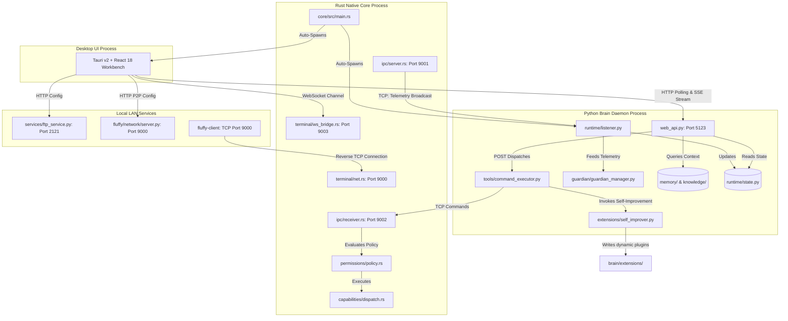

# Fluffy Assistant: Comprehensive Project Specification and Agent Guide

This document provides a complete technical analysis, functional breakdown, workflow understanding, function-to-file mappings, system architecture connection diagram, and progress scorecard for the **Fluffy Assistant** project. All information reflects the active codebase.

---

## 1. Functional Overview of Major Subsystems

### A. Fluffy Core (Rust Native Backend)
The Core is the native systems engine of Fluffy Assistant. Written in Rust, it interacts directly with system resources and APIs to execute low-latency operations, registry queries, and system-level management.
- Collects real-time system metrics (CPU, per-core utilization, RAM, process tree, network throughput, battery status, bluetooth availability, and startup entries) every 2 seconds.
- Dispatches and enforces first-class system capabilities (filesystem manipulation, application scanning/launching, process termination, system normalization sweeps).
- Broadcasts telemetry JSON messages over TCP Port `9001` (`ipc/server.rs`).
- Receives and evaluates command requests over TCP Port `9002` (`ipc/receiver.rs`).
- Hosts an interactive Terminal REPL, WebSocket stdout bridge on Port `9003` (`terminal/ws_bridge.rs`), and LAN TCP admin listener on Port `9000` (`terminal/net.rs`).

### B. Fluffy Brain (Python Intelligence & Orchestration Layer)
The Brain acts as the central intelligence daemon and execution coordinator.
- **Telemetry Ingestion**: Listens on TCP Port `9001` (`runtime/listener.py`), evaluates memory and CPU pressure signals, and updates thread-safe state store (`runtime/state.py`).
- **Guardian Anomaly Engine**: Detects behavioral anomalies using dynamic process fingerprinting, 5-minute rolling baselines, attack chain analysis, and risk scoring (`guardian/`).
- **Autonomous Agent & Tool Runtime**: Provides two-stage intent classification, parameter extraction, planning, and sandboxed tool execution (`agent/`, `tools/`).
- **Model Router & LLM Client**: Multi-provider client supporting Groq, OpenRouter, OpenAI, Anthropic, and local Ollama instances (`ai/`).
- **Semantic Memory & Knowledge**: Dual-layer memory (session context + long-term user preferences/whitelists) and vector search retrieval (`memory/`, `knowledge/`).
- **Web API & SSE Server**: Flask REST API and Server-Sent Events stream on Port `5123` (`web_api.py`) secured via token handshake (`X-Fluffy-Token`).
- **Self-Improving Extensions**: Autonomous code generation, AST syntax validation, and dynamic hot-reloading for custom plugins (`extensions/`).

### C. UI Operations Workbench (Tauri v2 + React 18 + TypeScript)
A desktop client built with Tauri v2, React 18, Vite, TypeScript, and vector SVG iconography.
- Structured into dedicated operational workspaces: Systems Overview, Hardware, Guardian Security, Operations & Normalization, Terminal & Remote Cluster, Chat & Voice, Knowledge & Artifacts, Extensions & Tools, Analytics, and Settings.
- Connects to Brain Web API (Port 5123) for state polling and SSE chat streaming.
- Connects to Core WebSocket Bridge (Port 9003) for real-time interactive terminal input/output.

### D. Voice Subsystem (Offline STT & TTS)
Provides natural speech processing without external cloud dependencies:
- **Speech-to-Text (STT)**: Captures microphone audio using `sounddevice` and transcribes locally using the **Vosk API** (`voice/stt/`).
- **Text-to-Speech (TTS)**: Spawns **Piper TTS** with an optimized multi-buffer parallel execution pipeline and direct audio playback (`voice/tts/`).

### E. File Sharing Service (FTP Server)
Implements a secure local network file sharing server using `pyftpdlib` on Port `2121`.
- Dynamically generates random 8-digit credentials on startup.
- Exposes selected shared directory (`FluffyShared`), tracks instantaneous upload/download bandwidth, and renders base64 QR codes for mobile connectivity (`services/`).

### F. LAN Remote Clustering & Administration
Enables peer-to-peer telemetry monitoring and remote shell administration:
- **Fluffy Network**: Role manager (`standalone`, `available`, `admin`) for cross-machine monitoring over Port 9000 (`fluffy/network/`).
- **Core Terminal Agent**: Client executable (`fluffy-client`) connects over reverse TCP to the admin Core server for remote diagnostics and process management.

---

## 2. Project File System Hierarchy

```text
FluffyAssistent/
|-- .agents/                                # Agent workflows and style guidelines
|   |-- rules/                              # Behavioral constraints (e.g. no_emojis.md)
|   `-- workflows/                          # Step-by-step workflow procedures
|-- .env / .env.example                     # Environment configuration (FLUFFY_TOKEN, API keys, paths)
|-- assets/                                 # Static binaries (Piper TTS exe, Vosk models) and logos
|-- brain/                                  # Python Intelligence, Guardian, Agent & Web API
|   |-- agent/                              # Agent planning, intent routing, and command parsing
|   |   |-- command_parser.py               # Intent Enum definitions
|   |   |-- intent_router.py                # Intent dispatcher
|   |   |-- interpreter.py                  # Telemetry metric interpretation rules
|   |   |-- llm_command_parser.py           # Two-Stage LLM classification & parameter extraction
|   |   `-- recommender.py                  # Optimization recommendation builder
|   |-- ai/                                 # LLM abstraction and providers
|   |   |-- clarifier.py                    # Parameter clarification builder
|   |   |-- intent_parser.py                # Prompt templates for intent parsing
|   |   |-- llm_client.py                   # Multi-provider client wrapper
|   |   |-- llm_config.py                   # Model settings and provider configuration
|   |   `-- llm_service.py                  # Streaming and completion execution service
|   |-- context/                            # Context injection and window management
|   |-- extensions/                         # Dynamic plugin engine and custom plugins
|   |   |-- code_generator.py               # LLM code generation for new plugins
|   |   |-- code_validator.py               # AST syntax parsing and validation
|   |   |-- extension_creator.py            # Manifest and handler writer
|   |   |-- extension_loader.py             # Hot-loading plugin manager
|   |   |-- registry.json                   # Installed plugins and regex patterns
|   |   `-- self_improver.py                # 3-retry self-healing execution loop
|   |-- guardian/                           # Behavioral Security Anomaly Submodule
|   |   |-- anomaly.py                      # Compares fingerprints against baselines
|   |   |-- audit.py                        # Audit logger recording security incidents
|   |   |-- baseline.py                     # 5-minute rolling usage baselines
|   |   |-- chain.py                        # Attack chain and sequence tracker
|   |   |-- fingerprint.py                  # Process CPU, RAM, network socket bandwidth tracker
|   |   |-- memory.py                       # Historical anomaly scores and whitelist store
|   |   |-- scorer.py                       # Risk score evaluation (Safe, Warn, Recommend, Prompt)
|   |   `-- verdict.py                      # Risk assessment verdict generator
|   |-- knowledge/                          # RAG, document ingestion, and vector embeddings
|   |-- mcp/                                # Model Context Protocol registry and client
|   |-- memory/                             # Memory Subsystem
|   |   |-- conversation/chat_history.py    # Conversation session persistence
|   |   |-- session/session_memory.py       # In-flight action memory and pending confirmations
|   |   `-- user/long_term_memory.py        # Persistent user preferences and trusted processes
|   |-- multimodal/                         # Multi-modal vision and audio processing
|   |-- routes/                             # Flask API Blueprints
|   |   |-- cluster_routes.py               # Distributed tasks endpoints
|   |   |-- extension_routes.py             # Plugin management CRUD endpoints
|   |   |-- ftp_routes.py                   # FTP server configuration endpoints
|   |   |-- network_routes.py               # LAN P2P role endpoints
|   |   |-- terminal_routes.py              # Terminal client and execution endpoints
|   |   `-- voice_routes.py                 # Speech configuration endpoints
|   |-- runtime/                            # Daemon runtime services
|   |   |-- alerts.py                       # Alert formatting helpers
|   |   |-- commands.py                     # TCP command client (sends to Core Port 9002)
|   |   |-- listener.py                     # Telemetry ingestion daemon (listens on Port 9001)
|   |   `-- state.py                        # Global thread-safe state store
|   |-- sandbox/                            # Restricted Python execution sandbox
|   |-- security/                           # Policy validation and auth
|   |   |-- action_validator.py             # Command safety validator
|   |   |-- auth_utils.py                   # Token handshake decorator
|   |   |-- guardian_manager.py             # Central Guardian coordinator
|   |   `-- security_monitor.py             # Threat scanner for process tree anomalies
|   |-- tools/                              # Tool registry and implementations
|   |   |-- app_utils.py                    # Windows/Linux app registry scanning & icons
|   |   |-- backup_manager.py               # System backup utility
|   |   |-- command_executor.py             # Execution dispatcher (files, apps, scripts)
|   |   |-- interrupt_handler.py            # Natural language task cancellation
|   |   |-- net_utils.py                    # Bandwidth speed test utility
|   |   `-- platform_utils.py               # Cross-platform OS abstraction layer
|   |-- listener.py                         # Daemon entrypoint (imports runtime/listener.py)
|   `-- web_api.py                          # Flask REST API and SSE server (Port 5123)
|-- core/                                   # Rust Native Systems Integration Backend
|   |-- Cargo.toml                          # Manifest (sysinfo, tokio, windows-sys, tungstenite)
|   `-- src/
|       |-- main.rs                         # Core entrypoint: Tokio runtime, servers, process spawns
|       |-- etw.rs                          # Windows ETW real-time per-PID network monitor
|       |-- actions/                        # Native execution actions
|       |   |-- filesystem.rs               # File and directory operations
|       |   |-- launcher.rs                 # Registry scanning and binary execution
|       |   `-- safety.rs                   # Path safety validator
|       |-- capabilities/                   # Capability registry and dispatch
|       |   |-- dispatch.rs                 # Dynamic capability invocation router
|       |   |-- registry.rs                 # Capability handler registry
|       |   `-- handlers/                   # Process, FS, App, System, Network handlers
|       |-- ipc/                            # Core Inter-Process Communication
|       |   |-- command.rs                  # Rust command schema enum
|       |   |-- protocol.rs                 # Telemetry message schema wrappers
|       |   |-- receiver.rs                 # Command TCP listener (Port 9002)
|       |   `-- server.rs                   # Telemetry TCP broadcaster (Port 9001)
|       |-- permissions/                    # Access policy and safety rules
|       |   |-- decision.rs                 # Allow, Deny, RequireConfirmation
|       |   `-- policy.rs                   # Safety boundary evaluation
|       `-- terminal/                       # Core Terminal REPL and WS Bridge
|           |-- app_state.rs                # Connected sessions and output history
|           |-- client_manager.rs           # TCP agent session coordinator
|           |-- net.rs                      # TCP admin socket listener (Port 9000)
|           |-- repl.rs                     # Shell command parser
|           `-- ws_bridge.rs                # WebSocket Server (Port 9003)
|-- docs/                                   # Architecture, Subsystem, and Workspace Docs
|   |-- ai/                                 # Local AI runtime and model router specs
|   |-- architecture/                       # Deep-dive architecture and contracts
|   |-- development/                        # Developer onboarding, testing, and IPC debugging
|   |-- security/                           # Threat models, sandbox limitations, and policies
|   |-- sih/                                # SIH project blueprint and matrix
|   `-- *.md                                # Workspace specifications
|-- fluffy/                                 # Distributed LAN monitoring package
|   `-- network/                            # Role manager, server, client, auth
|-- installer/                              # Windows installer scripts (Inno Setup)
|-- services/                               # Background services (FTP, QR code generator)
|-- ui/tauri/                               # Tauri v2 + React 18 Desktop Client
|   |-- src/
|   |   |-- app/                            # Root React App component and Workbench shell
|   |   |-- components/                     # Shared UI components (Icons, Modals, StatusBadge)
|   |   |-- features/                       # Workspace feature views
|   |   |   |-- analytics/                  # Telemetry graphs and logs
|   |   |   |-- chat/                       # Conversational assistant & voice view
|   |   |   |-- extensions/                 # Custom dynamic plugins view
|   |   |   |-- operations/                 # Normalization & process management
|   |   |   |-- settings/                   # Configuration, keys, and sovereignty
|   |   |   |-- systems/                    # Systems overview, hardware, and Guardian
|   |   |   `-- terminal/                   # Interactive console and LAN cluster
|   |   |-- services/                       # API clients, WebSocket client, event streaming
|   |   |-- stores/                         # State management stores
|   |   |-- styles/                         # CSS stylesheets and theme tokens
|   |   |-- themes/                         # Industrial dark and light theme definitions
|   |   |-- types/                          # TypeScript contracts and API interfaces
|   |   `-- main.tsx                        # React application entrypoint
|   `-- src-tauri/                          # Rust Tauri host configuration
`-- voice/                                  # Offline voice processing
    |-- voice_controller.py                 # STT listener and TTS speaker coordinator
    |-- stt/stt_engine.py                   # Vosk microphone recognition engine
    `-- tts/speaker.py                      # Piper TTS parallel execution pipeline
```

---

## 3. System Connection Architecture



---

## 4. Primary Functions to File Mapping

### Rust Core Subsystem
- **[core/src/main.rs](file:///c:/Users/sudip/OneDrive/Desktop/webProjects/FluffyAssistent/core/src/main.rs)**
  - `main()`: Initializes Tokio runtime, starts IPC listeners, spawns Python and Tauri processes, and executes 2-second telemetry loop.
  - `spawn_listener()`: Spawns the Python Brain daemon using `.env` paths.
  - `spawn_ui()`: Spawns the Tauri desktop workbench.
  - `collect_processes()`: Queries OS process statistics, memory, CPU, and process trees.
  - `get_startup_entries()`: Reads Windows registry run keys and startup folder items.
- **[core/src/ipc/receiver.rs](file:///c:/Users/sudip/OneDrive/Desktop/webProjects/FluffyAssistent/core/src/ipc/receiver.rs)**
  - `start_command_server()`: Binds TCP socket on port 9002 for incoming commands.
  - `handle_command()`: Evaluates requests against permissions policies and dispatches execution.
- **[core/src/capabilities/dispatch.rs](file:///c:/Users/sudip/OneDrive/Desktop/webProjects/FluffyAssistent/core/src/capabilities/dispatch.rs)**
  - `dispatch()`: Routes capability execution requests to registered capability handlers.
- **[core/src/terminal/ws_bridge.rs](file:///c:/Users/sudip/OneDrive/Desktop/webProjects/FluffyAssistent/core/src/terminal/ws_bridge.rs)**
  - `start_ws_bridge()`: Binds WebSocket server on port 9003 for frontend terminal streaming.
- **[core/src/terminal/repl.rs](file:///c:/Users/sudip/OneDrive/Desktop/webProjects/FluffyAssistent/core/src/terminal/repl.rs)**
  - `process_input()`: Parses shell commands (`help`, `use`, `sysinfo`, `rolecall`, `kill`, etc.).

### Python Brain Subsystem
- **[brain/runtime/listener.py](file:///c:/Users/sudip/OneDrive/Desktop/webProjects/FluffyAssistent/brain/runtime/listener.py)**
  - `main()`: Starts Flask API thread, connects to Core TCP port 9001, and processes telemetry stream.
  - `handle_message()`: Injects Security Monitor, Interpreter, Recommender, and Guardian analyses into telemetry.
  - `compute_signals()`: Evaluates memory and CPU pressure thresholds.
  - `compute_health()`: Determines composite system health index.
- **[brain/web_api.py](file:///c:/Users/sudip/OneDrive/Desktop/webProjects/FluffyAssistent/brain/web_api.py)**
  - `start_api()`: Starts the Flask HTTP server.
  - `status()`: Returns serialized global status and telemetry snapshots.
  - `chat_message()`: Processes incoming chat/voice requests.
  - `chat_stream()`: Streams AI tokens via Server-Sent Events (SSE).
- **[brain/agent/llm_command_parser.py](file:///c:/Users/sudip/OneDrive/Desktop/webProjects/FluffyAssistent/brain/agent/llm_command_parser.py)**
  - `parse_with_llm()`: Coordinates Stage 1 intent classification and Stage 2 parameter extraction.
- **[brain/tools/command_executor.py](file:///c:/Users/sudip/OneDrive/Desktop/webProjects/FluffyAssistent/brain/tools/command_executor.py)**
  - `execute()`: Dispatches intents to native Python tools or sends TCP commands to Core Port 9002.
- **[brain/guardian/guardian_manager.py](file:///c:/Users/sudip/OneDrive/Desktop/webProjects/FluffyAssistent/brain/guardian/guardian_manager.py)**
  - `analyze_processes()`: Coordinates process fingerprinting, baseline comparison, anomaly scoring, and alert generation.
- **[brain/extensions/self_improver.py](file:///c:/Users/sudip/OneDrive/Desktop/webProjects/FluffyAssistent/brain/extensions/self_improver.py)**
  - `execute_improvement()`: Autonomous plugin creation loop with AST validation and 3-retry repair cycle.

### UI React Workbench Subsystem
- **[ui/tauri/src/app/App.tsx](file:///c:/Users/sudip/OneDrive/Desktop/webProjects/FluffyAssistent/ui/tauri/src/app/App.tsx)**: Root workbench layout, sidebar navigation, top status bar, and active workspace router.
- **[ui/tauri/src/features/systems/views/SystemsOverview.tsx](file:///c:/Users/sudip/OneDrive/Desktop/webProjects/FluffyAssistent/ui/tauri/src/features/systems/views/SystemsOverview.tsx)**: Main system telemetry dashboard with real-time CPU/RAM meters and quick health indicators.
- **[ui/tauri/src/features/systems/views/HardwareView.tsx](file:///c:/Users/sudip/OneDrive/Desktop/webProjects/FluffyAssistent/ui/tauri/src/features/systems/views/HardwareView.tsx)**: Hardware metrics, battery condition, disk partitions, and bluetooth states.
- **[ui/tauri/src/features/terminal/views/TerminalView.tsx](file:///c:/Users/sudip/OneDrive/Desktop/webProjects/FluffyAssistent/ui/tauri/src/features/terminal/views/TerminalView.tsx)**: Interactive WebSocket terminal console with connected LAN node selector.
- **[ui/tauri/src/features/chat/views/ChatVoiceView.tsx](file:///c:/Users/sudip/OneDrive/Desktop/webProjects/FluffyAssistent/ui/tauri/src/features/chat/views/ChatVoiceView.tsx)**: Conversational assistant interface with SSE token streaming, voice visualizer, and tool artifacts.

---

## 5. Feature Completion Scorecard

* **Native System Telemetry (100%)**: CPU, per-core metrics, RAM, disk drives, process trees, network throughput, battery, bluetooth, and startup registry scanning are fully operational.
* **Guardian Behavioral Anomaly Engine (100%)**: Dynamic fingerprinting, 5-minute rolling baselines, anomaly detection, attack chains, and risk scoring are active.
* **React 18 Desktop Workbench (100%)**: Modern high-density dashboard with dark/light theme support, persistent navigation, multi-workspace routing, and vector SVG iconography.
* **Autonomous Agent & Tool Execution (100%)**: Two-stage intent classification, parameter extraction, multi-step execution, and policy checks are functional.
* **Dynamic Self-Improving Plugins (100%)**: On-demand code generation, AST syntax validation, hot-loading, and 3-retry repair loop are active.
* **Multi-Provider LLM & SSE Streaming (100%)**: Groq, OpenRouter, OpenAI, Anthropic, and local Ollama integrations with real-time token streaming.
* **Offline Vosk STT & Piper TTS (100%)**: Local speech recognition and parallel neural TTS audio playback are operational.
* **Interactive Terminal & WebSocket Bridge (100%)**: Port 9003 WS bridge and Port 9000 reverse TCP client management are active.
* **FTP File Sharing & QR Pairing (100%)**: Port 2121 FTP server with dynamic credentials, speed tracking, and QR code pairing.
* **Windows ETW Per-Process Network Tracking (80%)**: Real-time ETW event tracing infrastructure is in place in `core/src/etw.rs`.

---

## 6. Development Guidelines & Constraints

- **No Emojis**: Do not include emojis anywhere in UI components, logs, code, text messages, notifications, or documentation. Use vector SVG icons or clean semantic badges.
- **Minimal Code / YAGNI**: Avoid speculative abstractions, unnecessary boilerplate, or unused dependencies.
- **Safety First**: All destructive operations (process termination, registry edits, file deletion outside safe paths) require explicit policy validation or user confirmation.
- **Cross-Platform Compatibility**: Always utilize `platform_utils.py` in Python or `#[cfg(target_os)]` in Rust for OS-specific behavior.
