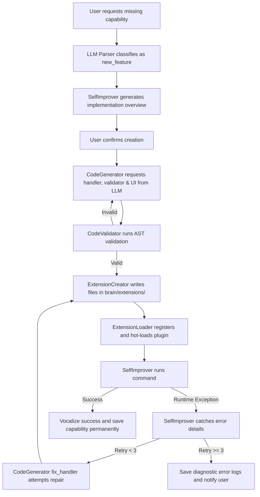
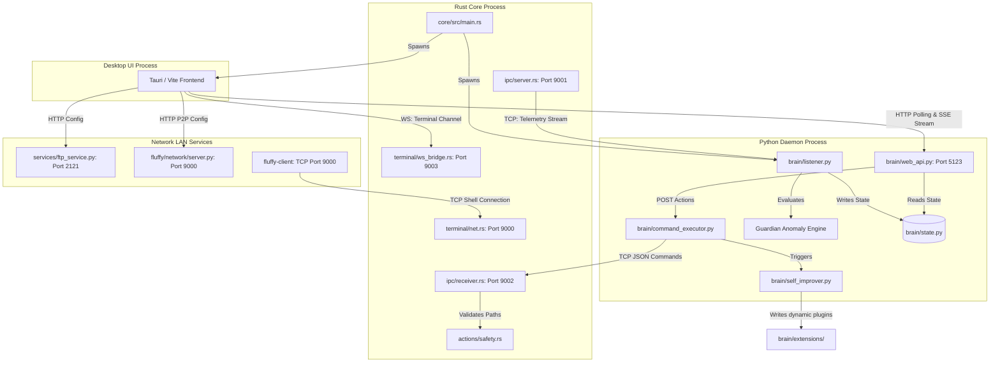

# Fluffy Assistant: Comprehensive Project Specification and Agent Guide

This file provides a complete technical analysis, functional breakdown, workflow understanding, function-to-file mappings, system architecture connection diagram, and progress report of the **Fluffy Assistant** project. All information in this document was compiled from scratch by analyzing the active codebase.

---

## 1. Functional Explanation of Major Modules

### A. Fluffy Core (Rust Backend)
The Core is the native systems interface of Fluffy Assistant. Written in Rust, it interacts directly with system resources and APIs to run operations that require speed, registry access, or system-level hooks. It collects real-time system metrics (CPU, RAM, network interfaces, battery stats, bluetooth) and manages critical actions (such as terminating tasks, adding registry autostarts, and executing system-wide normalization sweeps).

### B. Fluffy Brain (Python Daemon Backend)
The Brain acts as the central intelligence engine. Running as a background daemon, it handles telemetry ingestion, security log monitoring, natural language processing, LLM-based intent parsing/chat interactions, and voice assistant features. Additionally, it implements a **Self-Improver loop** that allows Fluffy to generate, compile, install, and self-heal new capabilities (plugins/extensions) dynamically.

### C. Voice Integration (STT & TTS)
Handles natural speech capabilities. It provides offline Speech-to-Text (STT) parsing of microphone input using the **Vosk API** and Text-to-Speech (TTS) voice generation using **Piper TTS** (with an optimized multi-buffer parallel execution pipeline and sound playback via Windows `winsound`).

### D. File Sharing Service (FTP Server)
Implements a secure local network file sharing server using `pyftpdlib`. It dynamically generates random 8-digit credentials on startup, exposes a selected shared directory (`FluffyShared`), tracks instantaneous upload/download bandwidth, and logs client interactions.

### E. Clustering & Network P2P Management
Facilitates peer-to-peer communication among multiple machines running Fluffy in a local network. A machine can operate in one of three modes:
- **Standalone**: Normal local monitor (default).
- **Available**: Runs an unauthenticated HTTP status server for other instances to monitor it.
- **Admin**: Polls and controls available remote nodes.

### F. UI Dashboard (Tauri & Frontend)
A desktop client built with **Tauri**, **Vite**, and **TypeScript**. It serves as the visual dashboard, rendering telemetry graphs, file transfers, logs, network clustering maps, active notifications, and a conversational AI chat panel.

### G. Reverse TCP Administration Terminal (Fluffy Core Terminal)
Enables reverse TCP shell connection and administration of remote nodes over the LAN (Port 9000). The Rust Core hosts a WebSocket bridge on Port 9003 to pipeline interactive commands and terminal history back-and-forth between the Tauri UI and the active terminal REPL. Includes a separate standalone terminal application (`terminal_for_fluffy`) built in Rust with `ratatui` for direct TUI control.

---

## 2. Project File System Hierarchy

Below is the directory tree of the active workspace with functional descriptions for each file:

```
FluffyAssistent/
├── core/                                   # Rust Systems Integration Backend
│   ├── Cargo.toml                          # Cargo manifest with system dependencies (sysinfo, windows, tokio)
│   ├── Cargo.lock                          # Dependency lockfile
│   └── src/
│       ├── main.rs                         # Application entrypoint: starts Tokio runtime, IPC servers, and spawns sub-processes
│       ├── etw.rs                          # Stub for ETW-based network monitoring (Windows-specific process tracking)
│       ├── actions/
│       │   ├── mod.rs                      # Module exports for filesystem, app launcher, and safety components
│       │   ├── filesystem.rs               # Operations: CreateFile, CreateFolder, DeleteFile, DeleteFolder, MoveFile, CopyFile
│       │   ├── launcher.rs                 # Fuzzy scanning of installed apps in Windows Registry / Linux /usr/bin
│       │   └── safety.rs                   # CheckPath validator: categorizes paths as Safe, NeedsConfirmation, or Blocked
│       ├── ipc/
│       │   ├── mod.rs                      # Module exports for IPC protocol and server setup
│       │   ├── command.rs                  # Rust command schema enum (KillProcess, NormalizeSystem, StartupAdd/Toggle/Remove)
│       │   ├── protocol.rs                 # Telemetry message schema wrappers
│       │   ├── receiver.rs                 # Command TCP listener (Port 9002): receives requests, validates, and runs them
│       │   └── server.rs                   # Telemetry TCP broadcaster (Port 9001): sends statistics to the Python Brain
│       ├── terminal/                       # Core Terminal REPL and WebSocket Bridge
│       │   ├── mod.rs                      # Module entry
│       │   ├── app_state.rs                # Holds active connections, output history, and targeted client
│       │   ├── repl.rs                     # Process command input (rolecall, help, alterations, broadcasts, local execution)
│       │   ├── ws_bridge.rs                # WebSocket Server (Port 9003) piping JSON output & commands to/from Tauri UI
│       │   ├── net.rs                      # Handles core TCP networking socket listeners
│       │   ├── client_manager.rs           # Manages connected TCP agent sessions
│       │   └── client_agent/               # Agent connections client logic
│       └── permissions/
│           ├── mod.rs                      # Module exports for decisions and policy evaluation
│           ├── decision.rs                 # Enum definitions: Allow, Deny, RequireConfirmation
│           └── policy.rs                   # Access rules evaluation mapping commands to safety decisions
│
├── brain/                                  # Python Orchestration Backend & Web API
│   ├── listener.py                         # Telemetry client daemon: listens on 9001, calculates signals, runs Guardian engine
│   ├── web_api.py                          # Flask REST API server (Port 5123) for UI dashboard communication
│   ├── state.py                            # Thread-safe global variable store (confirmations, logs, notifications, telemetry)
│   ├── interpreter.py                      # Rules engine generating natural language insights from CPU/RAM trends
│   ├── recommender.py                      # Suggestion builder recommending actions (e.g. closing memory offenders)
│   ├── security_monitor.py                 # Threat scanner evaluating system logs & processes for anomalies (path, spikes, etc.)
│   ├── action_validator.py                 # Evaluates safety level of requested commands
│   ├── app_utils.py                        # Scans registry, extracts executables icons (via PowerShell), and launches apps
│   ├── command_parser.py                   # Parsing utilities for intents
│   ├── llm_command_parser.py               # Two-Stage parser: Classifies intent (Stage 1), extracts parameters (Stage 2) via LLM
│   ├── command_executor.py                 # Executes intents (running scripts, writing code, typing text, starting search)
│   ├── code_generator.py                   # Interacts with LLM to write extension handlers, validators, and HTML UIs
│   ├── code_validator.py                   # Performs AST-based Python syntax check on LLM generated code
│   ├── extension_creator.py                # Writes handler.py, validator.py, and metadata.json for new plugins
│   ├── extension_loader.py                 # Scans extensions directory, registers JSON manifests, and hot-loads python code
│   ├── backup_manager.py                   # System backup utility for system configurations
│   ├── interrupt_handler.py                # Stops running tasks upon user request
│   ├── net_utils.py                        # Bandwidth speed testing utility
│   ├── platform_utils.py                   # Cross-platform helper functions (killing process, opening folders, resolving commands)
│   ├── chat_history.py                     # Manages database for chat sessions
│   ├── routes/                             # Flask API Blueprints (lazy-loaded modules)
│   │   ├── voice_routes.py                 # Speech configuration endpoints (/tts/speak, /test_stt, /stt_status)
│   │   ├── ftp_routes.py                   # FTP server controller endpoints (/ftp/start, /ftp/stop, /ftp/status, /ftp/logs)
│   │   ├── cluster_routes.py               # Distributed tasks execution endpoints (/cluster/start_manager, /cluster/submit_task)
│   │   ├── network_routes.py               # LAN P2P role endpoints (/network/role, /network/availability/connections)
│   │   ├── terminal_routes.py              # Flask blueprints for WS terminal communication (/terminal/clients, /terminal/command, /terminal/client-download)
│   │   └── extension_routes.py             # CRUD endpoints for managing custom extensions (/extensions, /extensions/code)
│   ├── guardian/                           # Anomaly Detection Submodule
│   │   ├── verdict.py                      # Level 2 risk assessment verdict generator
│   │   ├── anomaly.py                      # Compares current fingerprints against baseline limits
│   │   ├── baseline.py                     # Tracks rolling normal usage ranges over a 5-minute initialization window
│   │   ├── fingerprint.py                  # Tracks process CPU, RAM, network socket bandwidth, and children count
│   │   ├── chain.py                        # Tracks sequences of anomalies to increase risk scores
│   │   ├── scorer.py                       # Evaluates risk score levels (Safe, Warn, Recommend, Request Confirmation)
│   │   └── audit.py                        # Audit logger recording incidents on disk
│   ├── guardian_manager.py                 # Central manager instantiating global engines and executing resets
│   └── extensions/                         # Directory containing auto-generated custom capability plugins
│       └── registry.json                   # List of installed extensions, active patterns, directories, and status
│
├── voice/                                  # Offline Speech Modules
│   ├── __init__.py                         # Exposes voice controller convenience wrappers
│   ├── voice_controller.py                 # Coordinates Piper speaker queue and Vosk microphone listener
│   ├── stt/
│   │   └── stt_engine.py                   # Captures microphone audio using sounddevice and feeds it to Vosk Model
│   └── tts/
│       └── speaker.py                      # Spawns Piper.exe process, buffers WAV segments, and plays via winsound
│
├── services/                               # Local Area Services
│   ├── ftp_service.py                      # Starts FTPServer, manages access tokens, and calculates transmission speeds
│   ├── logs/
│   │   └── ftp_logs.json                   # Log repository for client FTP transfers
│   └── utils/
│       └── qr_generator.py                 # Renders access credentials into base64 QR codes for mobile connectivity
│
├── ui/                                     # Tauri Frontend Application
│   └── tauri/
│       ├── src/
│       │   ├── main.ts                     # Handles state polling, token extraction, chat styling, and event hooks
│       │   ├── styles.css                  # Core CSS definitions
│       │   ├── styles-enhanced.css         # Visual styling definitions
│       │   └── index.html                  # Main application DOM root
│       ├── src-tauri/
│       │   ├── src/
│       │   │   ├── main.rs                 # Tauri backend entrypoint
│       │   │   └── lib.rs                  # Setup Tauri command registrations and launch hooks
│       │   └── tauri.conf.json             # Tauri window settings and capabilities configuration
│       └── package.json                    # Node dependencies configuration for Dev Server
│
├── assets/                                 # Static Binary Utilities (Piper TTS exe, Vosk Models)
├── fluffy_data/                            # Global runtime database directory
│   ├── apps.json                           # Scanned installed software cache
│   └── guardian/                           # Guardian engine state database (baselines, audit log, memory)
│
├── terminal_for_fluffy/                    # Standalone Rust Ratatui TUI Dashboard & Client CLI
│   ├── fluffy-ui/                          # TUI widget library with consistent console styling
│   ├── fluffy/                             # Client and Admin command line engines
│   ├── plugins/                            # Extensions implementing the Fluffy plugin system
│   └── README.md                           # Documentation for command line terminal usage
│
├── .env                                    # API credentials and interpreter configurations (e.g. PYTHON_PATH, FLUFFY_TOKEN)
├── setup_env.ps1                           # PowerShell virtual environment setup helper script
├── setup_env.bat                           # CMD virtual environment setup helper script
├── setup_env.sh                            # Bash virtual environment setup helper script
```

---

## 3. Workflow Understanding

### A. System Boot Sequence
```mermaid
sequence_graph
1. User runs core executable (core/src/main.rs).
2. Core initializes Tokio runtime.
3. Core binds IPC Telemetry Port 9001, IPC Command Port 9002, WebSocket Bridge Port 9003, and TCP Admin Listener Port 9000.
4. Core reads PYTHON_PATH from .env and spawns "python listener.py" (brain/listener.py).
5. Core executes "npm run tauri dev" to open the desktop dashboard (ui/tauri).
6. "listener.py" runs, auto-generates a secure FLUFFY_TOKEN, and starts Flask API on port 5123.
7. "listener.py" connects as client to Core IPC Port 9001.
8. Tauri UI loads, fetches secure token from loopback API endpoint (http://127.0.0.1:5123/config/token), initializes WebSocket connection to Core Terminal Bridge (ws://127.0.0.1:9003), and starts polling status.
```

### B. Telemetry Ingestion & Guardian Analysis
- **Core Loop**: Every 2 seconds, the Rust core queries the OS for process information, network speeds, and CPU/RAM data.
- **IPC Broadcast**: Telemetry data is pushed as a JSON payload to Python `listener.py` on port 9001.
- **Daemon Processing**:
  - `listener.py` calculates system pressure. If the UI is inactive, it updates `BaselineEngine` and runs lightweight log audits.
  - If the UI is active, it runs **Guardian Engine**:
    1. Tracks process metrics via `FingerprintManager`.
    2. Measures metrics against `BaselineEngine`. (During the initial 5-minute learning phase, it only gathers data; no verdicts are emitted).
    3. Detects deviations (e.g., rapid child spawning, unexpected CPU/network spikes).
    4. Calculates risk scores.
    5. If a process exceeds the risk limit, it generates an alert, speaks the warning aloud via `voice_controller` ("Boss, process is taking 85% CPU"), and queues a termination prompt in `state.py`.
  - Injects parsed health state into the telemetry block and updates `state.LATEST_STATE`.

### C. Chat & Voice Command Execution
- The user speaks a command or submits a message in the Tauri Chat box.
- The UI triggers `POST /chat/message` on port 5123.
- `llm_command_parser.py` parses the text in two stages:
  - **Stage 1 (Fast Classify)**: Determines if it is `chat`, `command`, `confirmation`, or `new_feature` using a quick LLM call.
  - **Stage 2 (Parameter Extraction)**: If classified as a command, it parses the required parameters (e.g. `app_name`, `filename`, `content`).
- The parsed command is sent to `command_executor.py`:
  - System commands (e.g., `KillProcess`, `NormalizeSystem`, `StartupToggle`) are sent to Rust Core's TCP Command Server (Port 9002). Core verifies safety guidelines (`policy.rs`) and runs the action.
  - Scripting tasks (e.g., `write_code`, `research`, `type_text`) are processed directly in Python, saving code/notes on the Desktop and auto-opening paths.

### D. Self-Improvement & Healing Loop


---

## 4. Functions & File Mappings

Here is a mapping of the primary functions to their respective source files:

### Core (Rust)
- **[core/src/main.rs](file:///c:/Users/sudip/OneDrive/Desktop/webProjects/FluffyAssistent/core/src/main.rs)**
  - `main()`: Inits async runtime, runs servers, starts network monitor, and loops telemetry broadcast.
  - `spawn_listener()`: Spawns the python daemon process using `.env` configurations.
  - `spawn_ui()`: Executes the Tauri dashboard dev script.
  - `collect_processes()`: Queries OS process statistics.
  - `get_startup_entries()`: Reads HKCU and HKLM run keys and startup folder links.
- **[core/src/ipc/receiver.rs](file:///c:/Users/sudip/OneDrive/Desktop/webProjects/FluffyAssistent/core/src/ipc/receiver.rs)**
  - `start_command_server()`: Opens TCP socket on port 9002 to listen for actions.
  - `handle_command()`: Evaluates requests against security policies and executes them.
  - `execute()`: Invokes PowerShell scripts or OS calls to terminate processes or toggle startup apps.
- **[core/src/actions/safety.rs](file:///c:/Users/sudip/OneDrive/Desktop/webProjects/FluffyAssistent/core/src/actions/safety.rs)**
  - `check_path()`: Validates target paths against system directories.
- **[core/src/actions/launcher.rs](file:///c:/Users/sudip/OneDrive/Desktop/webProjects/FluffyAssistent/core/src/actions/launcher.rs)**
  - `scan_installed_apps()`: Reads registry keys to find installed application executables.
  - `launch_path()`: Spawns application executables.
- **[core/src/terminal/ws_bridge.rs](file:///c:/Users/sudip/OneDrive/Desktop/webProjects/FluffyAssistent/core/src/terminal/ws_bridge.rs)**
  - `start_ws_bridge()`: Binds TCP port 9003 for WebSocket front-end console streaming.
  - `handle_ws_connection()`: Spawns reader/writer tasks to route incoming WebSocket events to the REPL parser.
- **[core/src/terminal/repl.rs](file:///c:/Users/sudip/OneDrive/Desktop/webProjects/FluffyAssistent/core/src/terminal/repl.rs)**
  - `process_input()`: Parses and routes interactive shell command inputs (`help`, `use`, `sysinfo`, `rolecall`, etc.).

### Brain (Python)
- **[brain/listener.py](file:///c:/Users/sudip/OneDrive/Desktop/webProjects/FluffyAssistent/brain/listener.py)**
  - `main()`: Starts Web API thread, connects to core IPC port, and executes the telemetry ingestion loop.
  - `handle_message()`: Injects analysis (Security Monitor, Interpreter, Recommender, Guardian Engine) into telemetry.
  - `compute_signals()`: Evaluates memory/CPU pressure alerts.
  - `compute_health()`: Determines system health level based on active signals and logs.
  - `background_app_scanner()`: Worker thread scanning software cache every 24 hours.
- **[brain/web_api.py](file:///c:/Users/sudip/OneDrive/Desktop/webProjects/FluffyAssistent/brain/web_api.py)**
  - `start_api()`: Starts the Flask listener.
  - `status()`: Returns serialized global status information.
  - `chat_message()`: Processes incoming chat/voice requests.
  - `chat_stream()`: Streams chat responses via Server-Sent Events (SSE).
- **[brain/routes/terminal_routes.py](file:///c:/Users/sudip/OneDrive/Desktop/webProjects/FluffyAssistent/brain/routes/terminal_routes.py)**
  - `get_terminal_clients()`: Query WebSocket bridge for list of connected agent machines.
  - `post_terminal_command()`: Post a direct command to be routed to Core.
  - `download_terminal_client()`: Serves `fluffy-client.exe` to allow other local network computers to connect.
- **[brain/llm_command_parser.py](file:///c:/Users/sudip/OneDrive/Desktop/webProjects/FluffyAssistent/brain/llm_command_parser.py)**
  - `parse_with_llm()`: Coordinates Stage 1 classification and Stage 2 extraction.
  - `_stage1_classify()`: Queries LLM to classify user input.
  - `_stage2_extract()`: Extracts command arguments matching intent schemas.
- **[brain/command_executor.py](file:///c:/Users/sudip/OneDrive/Desktop/webProjects/FluffyAssistent/brain/command_executor.py)**
  - `execute()`: Dispatches intents to execution sub-methods.
  - `_execute_write_code()`: Instructs LLM to write a script, saves it to a folder, and opens it.
  - `_execute_create_project()`: Creates code projects using project templates.
  - `_type_text()`: Automates keyboard typing via PyAutoGUI.
- **[brain/self_improver.py](file:///c:/Users/sudip/OneDrive/Desktop/webProjects/FluffyAssistent/brain/self_improver.py)**
  - `execute_improvement()`: Runs code generation, builds, registers, and installs extensions.
- **[brain/code_generator.py](file:///c:/Users/sudip/OneDrive/Desktop/webProjects/FluffyAssistent/brain/code_generator.py)**
  - `generate_intent_handler()`: Requests python code blocks and handles validation retries.
  - `fix_handler()`: Requests repairs for broken handlers using exception traces.
- **[brain/code_validator.py](file:///c:/Users/sudip/OneDrive/Desktop/webProjects/FluffyAssistent/brain/code_validator.py)**
  - `validate_extension_code()`: Inspects generated code using Python's `ast` parsing library.
- **[brain/extension_loader.py](file:///c:/Users/sudip/OneDrive/Desktop/webProjects/FluffyAssistent/brain/extension_loader.py)**
  - `load_all_extensions()`: Scans plugin folder directories and registers handlers/validators.
  - `reload_extension()`: Hot-reloads specific python modules.
- **[brain/app_utils.py](file:///c:/Users/sudip/OneDrive/Desktop/webProjects/FluffyAssistent/brain/app_utils.py)**
  - `_scan_windows_registry()`: Discovers installed applications.
  - `_extract_icon_windows()`: Runs PowerShell commands to extract icons as base64 images.

### Services & Voice
- **[services/ftp_service.py](file:///c:/Users/sudip/OneDrive/Desktop/webProjects/FluffyAssistent/services/ftp_service.py)**
  - `start_ftp_server()`: Starts pyftpdlib server.
  - `calculate_speeds()`: Background worker tracking bandwidth utilization.
- **[voice/voice_controller.py](file:///c:/Users/sudip/OneDrive/Desktop/webProjects/FluffyAssistent/voice/voice_controller.py)**
  - `speak_guardian_alert()`: Converts Guardian verdicts into metrics-rich alerts.
  - `speak_custom()`: Runs text chunking and queues voice generation tasks.
- **[voice/tts/speaker.py](file:///c:/Users/sudip/OneDrive/Desktop/webProjects/FluffyAssistent/voice/tts/speaker.py)**
  - `speak_pipeline()`: Passes chunks to thread pools for parallel TTS audio generation.
  - `_generate_chunk_sync()`: Spawns Piper.exe to output audio to a temporary file.

---

## 5. System Connection Architecture

The following diagram illustrates how the system's processes, sockets, and protocols connect:



---

## 6. Project Development Progress

Based on a detailed scan of the codebase, here is the current completion state of the system:

### completed Features
*   **System Core Telemetry (100%)**: Robust memory/CPU/Network tracking, active sessions calculation, Windows registry startup application hooks, and Windows battery/bluetooth state retrieval are fully functional.
*   **Central Daemon loop (100%)**: TCP socket telemetry pipeline is fully operational with log interpretation, pressure thresholds, and system health status.
*   **Tauri Desktop Dashboard (100%)**: Connects automatically to the Flask API using dynamic token discovery from loopback queries, rendering responsive telemetry gauges, log records, and chat history.
*   **Vosk STT & Piper TTS (100%)**: Offline voice processing is configured. TTS uses a thread-safe parallel buffer generation pipeline for responsive playback.
*   **Unified Two-Stage LLM Command Parser (100%)**: The parser handles routing, classifies chat vs. commands, extracts arguments, and supports multi-step sequences.
*   **Automatic Self-Improvement & Healing (100%)**: Generates Python, Node JS, or HTML-based capabilities, creates manifests, hot-loads code on the fly, and uses a 3-retry self-healing executor.
*   **Guardian Engine Anomaly Detector (100%)**: Implements process fingerprinting, baselines creation, anomaly detection, risk scoring, conversational verbal warnings, and automatic process termination prompts.
*   **FTP Server (100%)**: Features dynamic password generation on boot, speed tracking, activity logs, client disconnection support, and credential QR code rendering.
*   **Network P2P Role Manager (100%)**: Role switching (standalone, available, admin), local node registration, and remote status polling are fully integrated.
*   **Reverse TCP Administration Terminal (100%)**: Real-time console terminal UI integrated in Tauri, WebSocket bridge for stdout streaming, remote agent download endpoint, and a standalone Ratatui CLI.

### Missing / Incomplete Features
*   **ETW Network Monitor (10%)**: The network monitor script in `core/src/etw.rs` is a stub. Process-level network statistics are not captured on the system and remain zeroed.
*   **Distributed Task Clustering (15%)**: While the HTTP blueprints in `cluster_routes.py` are mapped to expose start/stop, status, credentials, and task submission, the actual coordinator module `services/cluster.py` is missing. This prevents multi-node work orchestration.
